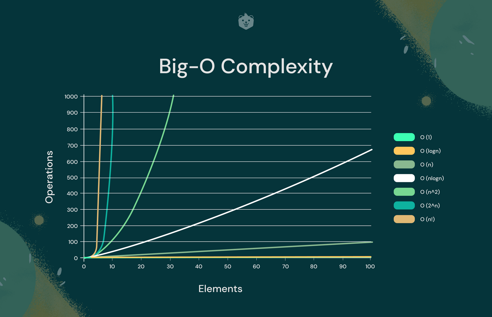
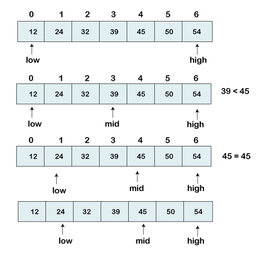
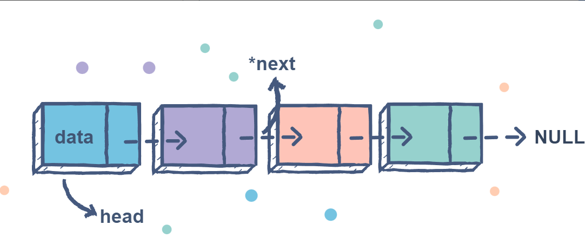

| Level | Question with Link | Description
## Course Structure

| Session | Topic                                                                         | Questions |
| ------- | ----------------------------------------------------------------------------- | --------- |
| 1       | [Introduction](#introduction)                                                 | NA        |
| 2       | [Arrays, List, Set, Tupels, Dictionary and Strings](#arrays-list-set-tuples-dictionary-and-strings)                                     | 34        |
| 3       | [Searching and Linked Lists](#searching-and-linked-lists)                            | 8         |
| 4       | [Recursion and Sorting Techniques](#searching-and-recursion)                           | 6         |
| 5       | [Stacks, Queues and Deques](#stacks-queues-and-deques)                        | 10        |
| 6       | [Trees Basic, Traversals, Binary Trees](#trees-basic-traversals-binary-trees) | 12        |
| 7       | [Heaps and Priority Queues](#heaps-and-priority-queues)                       | 8         |
| 8       | [Intro Graphs](#into-graphs)                                                   | 10        |
| 9      | [Graphs Algorithms](#graphs-algorithms)                                       | 12        |
| 10      | [Tries and MST](#tries-and-mst)                                               | 10        |
| 11      | [Hashing and Greedy algorithms](#hashing-and-greedy-algorithms)               | 8         |
| 12      | [Advance algorithms](#advance-algorithms)                                     | 13        |
| 14      | [DP](#dp)                                                                     | 10        |
| 14      | [CS Fundamentals](#cs-fundamentals)                                           | 6         |
| 15      | [Interview Tips and Tricks](#interview-tips-and-tricks)                       | N/A       |
| Total   |                                                                               | 120       |

# Introduction

Introduction to the course, data structures and algorithms. Overview of the course structure and expectations from students.

## Course Overview

This course provides a comprehensive introduction to data structures and algorithms used in computer science. Throughout the course, students will learn how to write efficient code, analyze algorithms, and design algorithms for complex problems. The course covers a range of topics, including programming basics, data structures, algorithm design techniques, searching and sorting algorithms, graph algorithms, dynamic programming, and greedy algorithms.

### Importance of Data Structures and Algorithms

Data structures and algorithms are essential for computer science and software development. They are used to store and manipulate data efficiently, and to solve complex problems. Understanding data structures and algorithms is essential for developing high-quality software, and for designing efficient algorithms. Without a good understanding of data structures and algorithms, it is challenging to develop software that can handle large amounts of data and complex operations.

### Prerequisites

The course assumes that students have a basic understanding of programming concepts such as control structures (if-else, loops, switch statements), functions and procedures, recursion, and basic data types (integers, floating-point numbers, strings, etc.). Familiarity with a programming language such as Python or Java is also helpful, but not essential. Students should have a basic understanding of mathematical concepts such as sets, functions, and graphs, and should be comfortable with algebra and basic calculus. The course is designed to be accessible to students with little to no prior experience in computer science, but a strong foundation in programming concepts and mathematical concepts is essential for success.

## Course Structure

The course is designed to prepare students for technical interviews and to develop their problem-solving skills. The course is divided into four sections:

1. Programming Basics

   - Control structures
   - Functions and procedures
   - Recursion
   - Basic data types
   - Time and Space complexity

2. Data Structures

   - Arrays and strings
   - Stacks and queues
   - Linked lists
   - Trees
   - Graphs

3. Algorithms

   - Algorithm design techniques
   - Searching and sorting algorithms
   - Graph algorithms
   - Dynamic programming
   - Greedy algorithms

4. Advanced Topics
   - Advanced data structures
   - Advanced algorithms
   - Computational geometry
   - NP-complete problems and approximation algorithms

Each section includes lectures, hands-on exercises, and practice problems, to help students build a solid foundation in computer science and prepare for technical interviews.

## Learning Outcomes

By the end of the course, students will be able to:

- Write efficient code, analyze algorithms, and design algorithms for complex problems.
- Have a deep understanding of programming concepts, data structures, and algorithms, and apply these concepts to solve real-world problems.
- Explain algorithmic complexity and perform algorithm analysis.
- Implement and optimize a range of algorithms.
- Use a variety of tools and technologies to develop software, including programming languages like Python, software tools like VS Code, and development environments like Jupyter Notebook.

## Tools and Technologies

The course will use a variety of tools and technologies to teach computer science concepts and prepare students for technical interviews. Students will use:

- Programming languages like [Python](https://www.python.org/) to implement algorithms and solve problems.
- Software tools like [VS Code](https://code.visualstudio.com/) to write and debug code.
- Development environments like [Jupyter Notebook](https://jupyter.org/) to run and test code.
- Online resources like [Stack Overflow](https://stackoverflow.com/), [LeetCode](https://leetcode.com/), and [GitHub](https://github.com/) to learn from others and collaborate on projects.

By using these tools and technologies, students will gain practical experience and develop the skills needed for software development and computer programming.

## Course Resources

Students will have access to a range of course resources, including textbooks, online resources, and reference materials. The course textbook is ["Introduction to Algorithms" by Cormen, Leiserson, Rivest, and Stein](https://mitpress.mit.edu/books/introduction-algorithms-third-edition), which is widely regarded as a classic in the field of computer science.

In addition to the textbook, students will have access to the following online resources:

- [Stack Overflow](https://stackoverflow.com/): a popular Q&A community for programmers
- [LeetCode](https://leetcode.com/): an online platform for practicing coding skills and algorithms
- [GitHub](https://github.com/): a web-based hosting service for version control and collaboration

Students will also have access to reference materials such as cheat sheets, sample code, and algorithmic templates, which will be provided by the course instructors. By using these resources, students will be able to reinforce their learning and develop their skills in data structures and algorithms.

## Introduction to the Instructor:

As an experienced software developer, I'm excited to be your instructor for this course on data structures and algorithms. Here are some highlights of what you can expect from me as your instructor:

- 7 years of experience in the software industry with top companies like Microsoft, Oracle, and Citrix
- Expertise in programming languages such as **JAVA**, **Python**, **C++**, **JavaScript**, and **MySQL**
- Thorough understanding of **data structures** and **algorithms**
- Bachelor's degree in Computer Science and Engineering
- Experience in **designing, testing**, and **developing software**
- Hands-on experience with **Azure**, **GCP**, and **AWS cloud services**
- Proficient in creating **CI/CD pipelines** and **leading teams** of software engineers
- Passionate about **learning** and staying up-to-date with the latest development techniques

You can find more information about me on my

- LinkedIn profile: https://www.linkedin.com/in/pankaj-kharkwal/
- Github profile: https://github.com/GalaxyHunter

# Introduction to Data Structures and Algorithms

## Python Overview and Installation Process

## Introduction to Python

Python is a high-level, **interpreted** programming language that was first released in 1991. It was created by Guido van Rossum and is now maintained by the Python Software Foundation. Python is popular because of its **simplicity**, **readability**, and **ease of use**. It has a large community of developers and a vast array of **libraries** and **frameworks**, making it a popular choice for a wide range of _applications_, from _web development to scientific computing_.

**_Python_** is a great choice for learning data structures and algorithms because it has a straightforward syntax and a strong emphasis on code readability. Python code is easy to read and understand, which makes it easier to learn and maintain. Additionally, Python has built-in data structures and algorithms that are commonly used in computer science, such as lists, tuples, dictionaries, and sorting algorithms.

## Installing Python

Python is available for **_Windows, MacOS, and Linux_**, and can be installed in several ways. The official Python website provides a downloadable installer for Windows and MacOS. For Linux users, Python is often pre-installed or can be installed using the system's package manager.

To install Python on Windows or MacOS, follow these steps:

1. Go to the official Python website at https://www.python.org/downloads/
2. Download the appropriate installer for your operating system and version of Python.
3. Run the installer and follow the instructions to install Python on your system.

To install Python on Linux, follow these steps:

1. Open the terminal.
2. Update the package manager using the following command:

```ubuntu
sudo apt-get update
```

3. Install Python using the package manager with the following command:

```ubuntu
sudo apt-get install python3
```

4. Verify that Python is installed correctly by running the following command:

```ubuntu
python3 --version
```

In addition to the official Python installer, there are also third-party distributions of Python that include additional libraries and tools, such as Anaconda or Miniconda. These distributions can be useful for scientific computing or data analysis.

## Basic Python

Control structures are used in programming to control the flow of a program based on certain conditions. There are three main types of control structures: `if-else statements`, `loops`, and `switch statements`.

**If-Else Statements**

If-else statements are used to execute different blocks of code based on a condition. The condition is evaluated as either true or false, and based on the result, the appropriate block of code is executed. For example:

```python
x = 10

if x > 5:
    print("x is greater than 5")
else:
    print("x is less than or equal to 5")
```

In this example, the condition `x > 5` is evaluated, and because `x` is `10`, the condition is `true`. Therefore, the first block of code is executed and the output is `"x is greater than 5"`.

**Loops**

Loops are used to repeat a block of code multiple times. There are two main types of loops in Python: `for loops` and `while loops`.

`For` loops are used to **iterate** over a sequence of values. Here's an example:

```python
for i in range(5):
    print(i)
```

In this example, the for loop iterates over the sequence of values `[0, 1, 2, 3, 4]` and prints each value.

`While loops` are used to repeat a block of code while a condition is `true`. Here's an example:

```python
x = 0

while x < 5:
    print(x)
    x += 1
```

**Switch Statements**

`Switch` statements are used to execute different blocks of code based on multiple conditions. However, switch statements are not natively supported in Python. An alternative to switch statements in Python is to use if-elif-else statements. Here's an example:

```python
day = 1

if day == 1:
    print("Monday")
elif day == 2:
    print("Tuesday")
elif day == 3:
    print("Wednesday")
elif day == 4:
    print("Thursday")
elif day == 5:
    print("Friday")
elif day == 6:
    print("Saturday")
else:
    print("Sunday")
```

In this example, the value of `x` is compared to each case using `if-elif-else` statements. If `x` matches one of the cases, the appropriate block of code is executed. If `x` doesn't match any of the cases, the `else` block is executed.

**Functions and Procedures**

`Functions` are a key concept in programming that allow you to define reusable blocks of code. A function is a self-contained block of code that performs a specific task. Functions are important in programming because they help to reduce `code duplication`, `improve code organization`, and make the code more `readable` and `maintainable`.

Defining Functions in Python
To define a function in Python, you use the def keyword, followed by the function name and any arguments. Here's an example:

```python
def greet(name):
    print(f"Hello, {name}!")

    greet("Alice")

```

In this example, we define a function called `greet` that takes a single argument `name`. The body of the function simply prints out a greeting message.

Calling Functions in Python
To call a function in Python, you simply use the function name, followed by any arguments. Here's an example:

```python
greet("Alice")
```

In this example, we call the `greet` function and pass in the string `"Alice"` as the name argument. The output is `Hello, Alice!`.

Return Values and Arguments

Functions can also `return` values and `accept` arguments. To return a value from a function in Python, you use the return keyword, followed by the value to be returned. Here's an example:

```python
def add_numbers(a, b):
    return a + b
```

In this example, we define a function called `add_numbers` that takes two arguments `a` and `b`. The body of the function adds `a` and `b` together and returns the `result`.

To use the return value of a function, you simply assign the result to a variable or use it in an expression. Here's an example:

```python
result = add_numbers(3, 4)
print(result)
```

In this example, we call the add_numbers function with arguments `3` and `4`, which returns the value `7`. We then assign the `result` to the `variable result` and print it out, which outputs `7`.

Functions can also accept multiple arguments, and you can provide default values for arguments to make them optional. Here's an example:

```python
def multiply_numbers(a, b=1):
    return a * b
```

In this example, we define a function called `multiply_numbers` that takes two arguments `a` and `b`, with a `default` value of `1` for `b`. The body of the function `multiplies` `a` and `b` together and returns the `result`.

To use the `multiply_numbers` function, you can either provide both a and b arguments, or just the `single` argument to use the default value of b. Here are some examples:

```python
result = multiply_numbers(3, 4)
print(result)

result = multiply_numbers(5)
print(result)
```

### Basic Data Types

Data types are a fundamental concept in programming that represent the different kinds of data that can be stored and manipulated in a program. Data types are important because they determine the kind of operations that can be performed on the data, and they affect the performance and memory usage of the program. Python supports a variety of data types, including `integers`, `floating-point numbers`, `strings`, and others.

### 1. Integers and Floating-Point Numbers

`Integers` and floating-point numbers are the most basic numeric data types in Python. Integers are whole numbers, such as `1`, `2`, `3`, and so on, while floating-point numbers are decimal numbers, such as `3.14`, `2.718`, and so on. Here are some examples of how to use integers and floating-point numbers in Python:

```python
x = 5
y = 3.14

# Arithmetic operations
z = x + y
print(z)

z = x * y
print(z)

z = x / y
print(z)

# Comparison operations
print(x > y)
print(x == y)
```

In this example, we define two variables `x` and `y`, with values `5` and `3.14`, respectively. We then perform various arithmetic and comparison operations on these values using the `+`, `*`, `/`, `>`, and `==` operators.

### Libraries

Introduction to libraries and data structures using Linked Lists. Implementation and problems on Linked Lists. 

Libraries are collections of pre-written code that are created to be reused in multiple programs. Libraries contain modules that contain functions, classes, and variables that provide developers with the ability to add new features to their code without having to write everything from scratch.

What are libraries used for in computer science?

Libraries are used for a variety of purposes in computer science, such as:

- Implementing commonly used algorithms and data structures.
- Providing functionality for input/output operations, like reading and writing files.
- Providing support for working with various file formats, such as JSON, CSV, or XML.
- Building user interfaces, such as GUI applications or web applications.
- Performing complex calculations and data analysis.

And much more.

How to install and use libraries in Python?

In Python, libraries can be installed using the pip package manager. To install a library, you can simply run the following command in your terminal or command prompt:

```python
pip install <library_name>
```
Once the library is installed, you can use it in your code by importing it at the beginning of your script. For example, to import the numpy library, you can use the following code:

```python
import numpy as np
```
This will make all the functions and classes from the numpy library available under the np namespace.

Common libraries used in computer science:

There are many popular libraries used in computer science, some of the most common ones include:

- NumPy: provides support for numerical operations and arrays.
- Pandas: provides support for data analysis and manipulation.
- Matplotlib: provides support for creating data visualizations.
- Scikit-learn: provides support for machine learning algorithms.
- TensorFlow: provides support for deep learning and neural networks.
- Flask: provides support for building web applications.
- Django: provides support for building web applications and websites.

Use cases for libraries in computer science:

Libraries can be used in a wide variety of applications in computer science. Some examples include:

- In data science, libraries like NumPy and Pandas can be used to process and analyze large datasets.
- In machine learning and artificial intelligence, libraries like Scikit-learn and TensorFlow can be used to train and test models.
- In web development, libraries like Flask and Django can be used to build web applications and websites.
- In scientific computing, libraries like SciPy and Matplotlib can be used to perform complex calculations and visualize data.


## Time and Space Complexity 

**Time and Space Complexity**:

In computer science, _time and space complexity_ refer to the amount of time and memory space required by an algorithm to solve a problem. Understanding time and space complexity is essential for developing efficient algorithms that can handle large data sets and run quickly.

**Time Complexity**:

_Time complexity_ refers to the number of steps or operations required by an algorithm to solve a problem. It is usually measured in terms of the input size of the problem. The bigger the input size, the more time an algorithm will take to solve the problem.

The time complexity of an algorithm is usually expressed using **Big O notation**, which represents the upper bound of the number of operations required by the algorithm. Common time complexities include _O(1)_, _O(n)_, _O(log n)_, _O(n log n)_, _O(n^2)_, etc.

**Space Complexity**:

_Space complexity_ refers to the amount of memory space required by an algorithm to solve a problem. It is usually measured in terms of the input size of the problem. The more memory space an algorithm requires, the more space complexity it has.

Common space complexities include constant, linear, logarithmic, etc.

**Trade-off between Time and Space Complexity**:

There is often a trade-off between time and space complexity. An algorithm that has a lower time complexity may require more memory space to store intermediate values, while an algorithm with lower space complexity may require more time to compute intermediate values.

**Optimizing Time and Space Complexity**:

Optimizing time and space complexity is an important aspect of algorithm design. By reducing the time and space complexity of an algorithm, we can improve its performance and efficiency.

One way to optimize time complexity is by using efficient data structures and algorithms, such as hash tables, binary search trees, and dynamic programming.

Similarly, we can optimize space complexity by using data structures that require less memory space, such as arrays, and by avoiding the creation of unnecessary variables or data structures.

In summary, understanding time and space complexity is essential for developing efficient algorithms that can handle large data sets and run quickly. By optimizing the time and space complexity of an algorithm, we can improve its performance and efficiency.


```python
# Analyze time complexity
def sum_first_n(n):
    """
    Returns the sum of the first n numbers.
    """
    total = 0   # O(1) - constant time complexity
    for i in range(n):  # O(n) - linear time complexity
        total += i   # O(1) - constant time complexity
    return total   # O(1) - constant time complexity

# The time complexity of the sum_first_n function is O(n).

# Analyze space complexity
def fibonacci(n):
    """
    Returns the nth number in the Fibonacci sequence.
    """
    fib = [0, 1]   # O(1) - constant space complexity
    for i in range(2, n + 1):   # O(n) - linear space complexity
        fib.append(fib[i - 1] + fib[i - 2])   # O(1) - constant space complexity
    return fib[n]   # O(1) - constant space complexity

# The space complexity of the fibonacci function is O(n).

# Optimize time complexity
def is_prime(n):
    """
    Returns True if n is prime, False otherwise.
    """
    if n <= 1:
        return False   # O(1) - constant time complexity
    for i in range(2, int(n ** 0.5) + 1):   # O(sqrt(n)) - square root time complexity
        if n % i == 0:
            return False   # O(1) - constant time complexity
    return True   # O(1) - constant time complexity

# The time complexity of the is_prime function is O(sqrt(n)).

# Compare time complexity
def linear_search(arr, x):
    """
    Returns the index of x in arr, or -1 if x is not in arr.
    """
    for i in range(len(arr)):   # O(n) - linear time complexity
        if arr[i] == x:
            return i   # O(1) - constant time complexity
    return -1   # O(1) - constant time complexity

def binary_search(arr, x):
    """
    Returns the index of x in arr, or -1 if x is not in arr.
    """
    low = 0   # O(1) - constant time complexity
    high = len(arr) - 1   # O(1) - constant time complexity
    while low <= high:   # O(log n) - logarithmic time complexity
        mid = (low + high) // 2   # O(1) - constant time complexity
        if arr[mid] < x:
            low = mid + 1   # O(1) - constant time complexity
        elif arr[mid] > x:
            high = mid - 1   # O(1) - constant time complexity
        else:
            return mid   # O(1) - constant time complexity
    return -1   # O(1) - constant time complexity

# The linear_search function has a time complexity of O(n),
# while the binary_search function has a time complexity of O(log n).
```
# Arrays, List, Set, Tupels, Dictionary and Strings

Study of Arrays and Strings with some basic problems.

## Arrays Introduction

`Arrays` are a fundamental data structure in computer science that allow programmers to `store` and `manipulate` data efficiently. An array is a collection of elements of the `same data type`, arranged in a **contiguous** block of memory. Arrays are used in computer science for a variety of purposes, such as storing data, organizing data, and performing operations on data.

### Comparison of Arrays with Other Data Structures

Arrays are often compared with other data structures, such as `linked lists`, `stacks`, and `queues`. One advantage of using arrays is that they allow for `constant` time access to individual elements, as each element can be accessed directly using an `index`. In contrast, linked lists, stacks, and queues may require `traversing` the list or stack to access a specific element, which can be `slower`. Another advantage of arrays is that they are simple to implement and can be used for a wide variety of applications.

However, arrays also have some `disadvantages`. One disadvantage is that they have a `fixed size`, which can make them inflexible in some situations. Another disadvantage is that `inserting` or `deleting` elements in the `middle` of an array can be slow, as it requires `shifting` all the subsequent elements. Linked lists, stacks, and queues are often better suited for these kinds of operations.

### Creation of Arrays in Python

In Python, arrays can be created using either the built-in array module or using lists. The array module provides a way to create arrays of a specific data type, such as `integers` or `floating-point `numbers.

Here's an example of how to create an array using the array module:

```python
import array

my_array = array.array('i', [1, 2, 3, 4, 5])
```

In this example, we create an array my_array that contains integers ('i'). The array is initialized with the values `[1, 2, 3, 4, 5]`.

`Lists`, on the other hand, are a more flexible data structure that can hold elements of different data types.

Here's an example of how to create a list in Python

```python
my_list = [1, 2, 3, 4, 5]
```

### Accessing Elements in an Array

In Python, elements in an array can be accessed using an index, starting with 0.

Here's an example of how to access elements in an array:

```python
import array

my_array = array.array('i', [1, 2, 3, 4, 5])

# Accessing elements
print(my_array[0])
print(my_array[2])
```

In this example, we define an array `my_array` and use the index operator (`[]`) to access elements at positions `0` and `2`.

### Modifying Elements in an Array

Elements in an array can also be modified in Python.

Here's an example of how to modify elements in an array:

```python
import array

my_array = array.array('i', [1, 2, 3, 4, 5])

# Modifying elements
my_array[0] = 10
my_array[2] = 30

print(my_array)
```

**Output** : `array('i', [10, 2, 30, 4, 5])`

In this example, we define an array my_array and modify elements at positions 0 and 2 using the index operator (`[]`). The modified array is then printed to the console.

### Arrays Operations

#### Basic Operations in Arrays

Arrays support a variety of basic operations, including `inserting` elements, `deleting` elements, and `searching` for elements. Inserting elements in an array involves `adding` a new element to a specific position in the array. Deleting elements involves `removing` an element from a specific position in the array. Searching for elements in an array involves `finding` the position of a specific element in the array.

#### Slicing Arrays in Python

In Python, arrays can be sliced using the colon (`:`) operator. `Slicing` allows you to retrieve a portion of an array. Here's an example of how to slice an array in Python:

```Python
import array

my_array = array.array('i', [1, 2, 3, 4, 5])

# Slicing the array
print(my_array[1:4])
```

In this example, we define an array `my_array` and use slicing to retrieve the elements at positions 1 through 3. The sliced portion of the array is then printed to the console.

#### Resizing Arrays in Python

In Python, arrays can be resized using the array.resize() method.

Concatenating Arrays in Python

In Python, arrays can be concatenated using the + operator. Here's an example of how to concatenate two arrays in Python:

```python
import array

my_array1 = array.array('i', [1, 2, 3])
my_array2 = array.array('i', [4, 5, 6])

# Concatenating the arrays
my_array = my_array1 + my_array2

print(my_array)
```

Here's an examples of operation on an array in Python:

```python
import array

# Creating an array
my_array = array.array('i', [1, 2, 3, 4, 5])
print(my_array) # array('i', [1, 2, 3, 4, 5])

# Inserting an element
my_array.insert(2, 10)
print(my_array) # array('i', [1, 2, 10, 3, 4, 5])

# Deleting an element
my_array.pop(3)
print(my_array) # array('i', [1, 2, 10, 4, 5])

# Searching for an element
print(my_array.index(10)) # 2

# Slicing an array
print(my_array[1:4]) # array('i', [2, 10, 4])

# Resizing an array
my_array.resize(3)
print(my_array) # array('i', [1, 2, 10])

# Concatenating arrays
my_array1 = array.array('i', [1, 2, 3])
my_array2 = array.array('i', [4, 5, 6])
my_array = my_array1 + my_array2
print(my_array) # array('i', [1, 2, 3, 4, 5, 6])

```

## 2D Arrays/Matrix

### Definition of 2D Arrays

A **2D array**, also known as a **matrix**, is a collection of elements arranged in a grid format with rows and columns. Each element in a 2D array is identified by its row and column index. In computer science, 2D arrays are used to store and organize data in a way that makes it easy to perform operations on the data.

### Uses of 2D Arrays in Computer Science

2D arrays are used in computer science for a variety of purposes, such as storing images, representing game boards, and performing matrix operations. They can also be used to store tabular data, such as spreadsheet data.

### Creation of 2D Arrays in Python

In Python, 2D arrays can be created using nested lists. Here's an example of how to initialize a 2D array in Python:


```python
# Initializing a 2D array
my_array = [[1, 2, 3], [4, 5, 6], [7, 8, 9]]

```

In this example, we define a 2D array `my_array` with three rows and three columns.

### Accessing Elements in a 2D Array

In Python, elements in a 2D array can be accessed using the row and column indices.

```python
# Accessing an element in a 2D array
my_array = [[1, 2, 3], [4, 5, 6], [7, 8, 9]]
print(my_array[1][2]) # 6
```
In this example, we retrieve the element at row 1 and column 2 from the 2D array `my_array`.

### Modifying Elements in a 2D Array

In Python, elements in a 2D array can be modified using the row and column indices. Here's an example of how to change an element in a 2D array:

```python
# Modifying an element in a 2D array
my_array = [[1, 2, 3], [4, 5, 6], [7, 8, 9]]
my_array[1][2] = 10
print(my_array) # [[1, 2, 3], [4, 5, 10], [7, 8, 9]]
```
| #  | Level  | Question Name (Link)                                                            | Questions                                                                                                                                                                                                                                                                                                                |
|----|--------|---------------------------------------------------------------------------------|--------------------------------------------------------------------------------------------------------------------------------------------------------------------------------------------------------------------------------------------------------------------------------------------------------------------------|
| 1  | Easy   | [Two Sum](https://leetcode.com/problems/two-sum/)                               | Given an array of integers, find two numbers such that they add up to a specific target number.                                                                                                                                                                                                                         |
| 2  | Easy   | [Best Time to Buy and Sell Stock](https://leetcode.com/problems/best-time-to-buy-and-sell-stock/) | Say you have an array for which the ith element is the price of a given stock on day i. Design an algorithm to find the maximum profit.                                                                                                                                                                                   |
| 3  | Easy   | [Remove Duplicates from Sorted Array](https://leetcode.com/problems/remove-duplicates-from-sorted-array/) | Given a sorted array nums, remove the duplicates in-place such that each element appear only once and return the new length.                                                                                                                                                                                             |
| 4  | Medium | [Search in Rotated Sorted Array](https://leetcode.com/problems/search-in-rotated-sorted-array/) | Suppose an array sorted in ascending order is rotated at some pivot unknown to you beforehand. (i.e., [0,1,2,4,5,6,7] might become [4,5,6,7,0,1,2]). You are given a target value to search. If found in the array return its index, otherwise return -1.                                                                         |
| 5  | Medium | [Container With Most Water](https://leetcode.com/problems/container-with-most-water/) | Given n non-negative integers a1, a2, ..., an , where each represents a point at coordinate (i, ai). n vertical lines are drawn such that the two endpoints of line i is at (i, ai) and (i, 0). Find two lines, which together with x-axis forms a container, such that the container contains the most water.                          |
| 6  | Medium | [Spiral Matrix](https://leetcode.com/problems/spiral-matrix/)                   | Given a matrix of m x n elements (m rows, n columns), return all elements of the matrix in spiral order.                                                                                                                                                                                                                 |
| 7  | Medium | [Set Matrix Zeroes](https://leetcode.com/problems/set-matrix-zeroes/)           | Given a m x n matrix, if an element is 0, set its entire row and column to 0. Do it in-place.                                                                                                                                                                                                                            |
| 8  | Medium | [Search a 2D Matrix](https://leetcode.com/problems/search-a-2d-matrix/)         | Write an efficient algorithm that searches for a value in an m x n matrix. This matrix has the following properties: Integers in each row are sorted from left to right. The first integer of each row is greater than the last integer of the previous row.                                                                  |
| 9  | Hard   | [Unique Paths](https://leetcode.com/problems/unique-paths/)                     | A robot is located at the top-left corner of a m x n grid (marked 'Start' in the diagram below). The robot can only move either down or right at any point in time. The robot is trying to reach the bottom-right corner of the grid (marked 'Finish' in the diagram below). How many possible unique paths are there? |
| 10 | Hard   | [Game of Life](https://leetcode.com/problems/game-of-life/)                     | According to Wikipedia's article: "The Game of Life, also known simply as Life, is a cellular automaton devised by the British mathematician John Horton Conway in 1970.


## Arrays, Lists, Sets, Dictionary

### Difference between Arrays, Lists, Sets, Dictionary in Python

In Python, **arrays**, **lists**, **sets**, and **dictionaries** are used to store and organize data in different ways. Here's a brief overview of each data structure:

- **Arrays:** Arrays are used to store a collection of elements of the same data type in contiguous memory locations.
- **Lists:** Lists are used to store a collection of elements of different data types. They are mutable, which means that elements can be added, removed, or modified.
- **Sets:** Sets are used to store a collection of unique elements. They are unordered and mutable, which means that elements can be added or removed, but not modified.
- **Dictionaries:** Dictionaries are used to store a collection of key-value pairs. They are unordered and mutable, which means that elements can be added, removed, or modified.

## Advantages and disadvantages of using Arrays, Lists, Sets, Dictionary

Each data structure has its own advantages and disadvantages. Here's a brief overview:

- **Arrays:** Advantages of using arrays include fast access to elements and efficient memory usage. However, arrays have a fixed size and are not flexible, which can be a disadvantage.
- **Lists:** Advantages of using lists include their flexibility and ease of use. However, accessing elements in a list can be slow, especially for large lists.
- **Sets:** Advantages of using sets include their ability to store unique elements and their fast access times. However, sets are not indexed and cannot store duplicate elements.
- **Dictionaries:** Advantages of using dictionaries include their ability to store key-value pairs and their fast access times. However, dictionaries are not ordered and cannot store duplicate keys.

```python
# Initializing a list and performing basic operations
my_list = [1, 2, 3, 4, 5]
my_list.append(6)
print(my_list) # [1, 2, 3, 4, 5, 6]
print(my_list[3]) # 4
del my_list[2]
print(my_list) # [1, 2, 4, 5, 6]

# Converting a list to an array and performing operations
import array as arr
my_array = arr.array('i', my_list)
my_array.append(7)
print(my_array) # array('i', [1, 2, 4, 5, 6, 7])
print(my_array[2]) # 4
my_array.remove(2)
print(my_array) # array('i', [1, 4, 5, 6, 7])

# Converting an array to a list and performing operations
my_list = my_array.tolist()
my_list.append(8)
print(my_list) # [1, 4, 5, 6, 7, 8]
print(my_list[2]) # 5
my_list.pop(1)
print(my_list) # [1, 5, 6, 7, 8]
```


## Definition of sets:
Sets are a collection of unique elements in Python. They are unordered and can be modified.

## What are sets used for in computer science:
Sets are used to remove duplicate elements from a sequence. They are also used for mathematical set operations such as union, intersection, and difference.

## Creation of sets in Python:
Sets can be created in Python using curly braces {} or using the set() constructor.

Example:

```python
my_set = {1, 2, 3}
my_set = set([1, 2, 3])
```

### Basic set operations (union, intersection, difference, etc.):
Sets in Python support several basic operations like union, intersection, difference, and symmetric difference. These operations can be performed using operators or built-in functions.

Example:
```python
set1 = {1, 2, 3}
set2 = {3, 4, 5}

# union
print(set1 | set2) # {1, 2, 3, 4, 5}
print(set1.union(set2)) # {1, 2, 3, 4, 5}

# intersection
print(set1 & set2) # {3}
print(set1.intersection(set2)) # {3}

# difference
print(set1 - set2) # {1, 2}
print(set1.difference(set2)) # {1, 2}

# symmetric difference
print(set1 ^ set2) # {1, 2, 4, 5}
print(set1.symmetric_difference(set2)) # {1, 2, 4, 5}
```
### Set comprehensions in Python:

Set comprehensions are similar to list comprehensions in Python but return a set instead of a list. They can be used to create a set from any iterable object.

Example:
```python
my_list = [1, 2, 3, 4, 5]
my_set = {x for x in my_list if x % 2 == 0}
print(my_set) # {2, 4}
```
Use cases for sets in computer science:
Sets are used for a variety of applications in computer science, such as removing duplicates from a list, checking for the presence of elements, performing mathematical operations, and implementing algorithms such as the sieve of Eratosthenes.

```python
# Initialize a set and perform basic operations
my_set = {1, 2, 3, 4, 5}
print(my_set) # {1, 2, 3, 4, 5}

# Add an element to the set
my_set.add(6)
print(my_set) # {1, 2, 3, 4, 5, 6}

# Remove an element from the set
my_set.remove(2)
print(my_set) # {1, 3, 4, 5, 6}

# Check if an element is in the set
print(3 in my_set) # True
print(2 in my_set) # False

# Perform set comprehensions
my_list = [1, 2, 3, 4, 5]
my_set = {x for x in my_list if x % 2 == 0}
print(my_set) # {2, 4}

# Perform set operations (union, intersection, difference, etc.)
set1 = {1, 2, 3}
set2 = {3, 4, 5}

# union
print(set1 | set2) # {1, 2, 3, 4, 5}
print(set1.union(set2)) # {1, 2, 3, 4, 5}

# intersection
print(set1 & set2) # {3}
print(set1.intersection(set2)) # {3}

# difference
print(set1 - set2) # {1, 2}
print(set1.difference(set2)) # {1, 2}

# symmetric difference
print(set1 ^ set2) # {1, 2, 4, 5}
print(set1.symmetric_difference(set2)) # {1, 2, 4, 5}
```


## Tuples

`Tuples` are `ordered`, `immutable` sequences of elements in Python. They are similar to lists but are immutable, meaning their values `cannot` be `changed` once they are defined. Tuples are defined by enclosing a `comma-separated` sequence of values in `parentheses`.

- Uses of tuples in computer science

Tuples are commonly used in computer science for `storing` and `returning` multiple values from a function, as they allow the programmer to group related data together in a single object. Tuples can also be used for `data compression` and `data protection` since their values cannot be changed once they are defined.

- Creation of tuples in Python

Tuples can be created in Python by enclosing a comma-separated sequence of values in parentheses. For example:

```python
my_tuple = (1, 2, 3, 4, 5)
```

- Accessing elements in a tuple

Elements in a tuple can be accessed using indexing, similar to how elements are accessed in a list. For example:

```python
my_tuple = (1, 2, 3, 4, 5)
print(my_tuple[0])  # Output: 1
```
- Modifying elements in a tuple

Tuples are immutable, meaning that their values cannot be changed once they are defined. If you want to modify a tuple, you must create a new tuple with the desired changes. For example:

```python
my_tuple = (1, 2, 3, 4, 5)
new_tuple = my_tuple[:2] + (6, 7, 8) + my_tuple[3:]
print(new_tuple)  # Output: (1, 2, 6, 7, 8, 5)
```
- Basic operations in tuples (slicing, concatenating, searching)

Tuples support many of the same operations as lists, such as slicing and concatenation. For example:

```python
my_tuple = (1, 2, 3, 4, 5)
print(my_tuple[1:3])  # Output: (2, 3)

tuple1 = (1, 2, 3)
tuple2 = (4, 5, 6)
new_tuple = tuple1 + tuple2
print(new_tuple)  # Output: (1, 2, 3, 4, 5, 6)

my_tuple = (1, 2, 3, 4, 5)
print(3 in my_tuple)  # Output: True

```
- Convert a tuple to a list and vice-versa

Tuples and lists can be converted back and forth using the list() and tuple() functions in Python. For example:

```python
my_tuple = (1, 2, 3, 4, 5)
my_list = list(my_tuple)
print(my_list)  # Output: [1, 2, 3, 4, 5]

my_list = [1, 2, 3, 4, 5]
my_tuple = tuple(my_list)
print(my_tuple)  # Output: (1, 2, 3, 4, 5)
```

```python
# Initialize a tuple
my_tuple = (1, 2, 3, 4, 5)

# Accessing elements in a tuple
print(my_tuple[0])  # Output: 1
print(my_tuple[-1])  # Output: 5
print(my_tuple[2:4])  # Output: (3, 4)

# Modifying elements in a tuple
# Tuples are immutable in Python and cannot be modified directly
# However, you can convert the tuple to a list, modify the list, and then convert it back to a tuple
my_list = list(my_tuple)
my_list[2] = 6
my_tuple = tuple(my_list)
print(my_tuple)  # Output: (1, 2, 6, 4, 5)

# Basic operations in tuples
# Concatenating tuples
my_tuple1 = (1, 2, 3)
my_tuple2 = (4, 5, 6)
my_tuple3 = my_tuple1 + my_tuple2
print(my_tuple3)  # Output: (1, 2, 3, 4, 5, 6)

# Slicing tuples
my_tuple4 = my_tuple3[2:5]
print(my_tuple4)  # Output: (3, 4, 5)

# Searching for elements in a tuple
if 4 in my_tuple4:
    print("Element found!")
else:
    print("Element not found.")

# Converting a tuple to a list and vice versa
my_list2 = list(my_tuple4)
print(my_list2)  # Output: [3, 4, 5]
my_tuple5 = tuple(my_list2)
print(my_tuple5)  # Output: (3, 4, 5)
```

## Dictionaries:

A dictionary is a collection of key-value pairs that can be used to store and retrieve data in Python. Dictionaries are unordered, changeable, and indexed. Each key in a dictionary maps to a specific value.

### What are dictionaries used for in computer science:

Dictionaries are used for a variety of tasks in computer science, such as storing and retrieving data quickly, indexing data for fast lookup, and mapping data to specific keys.

### Creation of dictionaries in Python:

Dictionaries can be created in Python using curly braces {} or using the dict() constructor. Keys and values are separated by a colon ":" and each key-value pair is separated by a comma ",".

```python
# create a dictionary using curly braces
my_dict = {'name': 'John', 'age': 25, 'city': 'New York'}

# create a dictionary using the dict() constructor
my_dict = dict(name='John', age=25, city='New York')
```
### Accessing elements in a dictionary:

Elements in a dictionary can be accessed using their keys. If a key does not exist in the dictionary, a KeyError exception will be raised.

```python
# access elements in a dictionary
print(my_dict['name'])  # output: John
```
### Modifying elements in a dictionary:

Elements in a dictionary can be modified by assigning a new value to the key. If the key does not exist in the dictionary, a new key-value pair will be created.

```python
# modify elements in a dictionary
my_dict['age'] = 30
print(my_dict)  # output: {'name': 'John', 'age': 30, 'city': 'New York'}

```
### Dictionary comprehensions in Python:
Dictionary comprehensions are a concise way to create dictionaries using an iterable object. They follow a similar syntax to list comprehensions, but use curly braces {} instead of square brackets [].

```python
# create a dictionary using dictionary comprehension
my_dict = {x: x**2 for x in range(5)}
print(my_dict)  # output: {0: 0, 1: 1, 2: 4, 3: 9, 4: 16}
```
### Use cases for dictionaries in computer science:

Dictionaries are commonly used in computer science for tasks such as caching data, storing user preferences, and indexing large datasets. They are also useful for creating lookup tables and mapping data to specific keys.

| Data Structure | Features                                                                                     | Time Complexity                      |
|----------------|----------------------------------------------------------------------------------------------|--------------------------------------|
| Array          | A collection of elements of the same data type, stored in contiguous memory locations. Can be accessed by index. | Retrieval: O(1), Insertion/Deletion: O(n) |
| List           | Similar to arrays, but can store elements of different data types. Can be resized dynamically. | Retrieval: O(1), Insertion/Deletion: O(n) |
| Set            | A collection of unique elements, unordered. Can be used to perform set operations.            | Retrieval: O(1), Insertion/Deletion: O(1) |
| Tuple          | Similar to lists, but are immutable. Can store elements of different data types.              | Retrieval: O(1), Insertion/Deletion: N/A   |
| Dictionary     | A collection of key-value pairs, unordered. Can be used to perform dictionary operations.     | Retrieval: O(1), Insertion/Deletion: O(1) |


| # | Level | Problem Title                                                                               | Question                                                                                                  |
|---|-------|---------------------------------------------------------------------------------------------|-----------------------------------------------------------------------------------------------------------|
|11 | Set   | [Two Sum](https://leetcode.com/problems/two-sum/)                                           |Given an array of integers nums and an integer target, return indices of the two numbers such that they add up to target.                                                 |
|12 | Set   | [Intersection of Two Arrays](https://leetcode.com/problems/intersection-of-two-arrays/)   |Given two integer arrays nums1 and nums2, return an array of their intersection. Each element in the result must be unique and you may return the result in any order.   |
|13 | Set   | [Valid Sudoku](https://leetcode.com/problems/valid-sudoku/)                                |Determine if a 9 x 9 Sudoku board is valid.                                                                 |
|14 | Set   | [Longest Consecutive Sequence](https://leetcode.com/problems/longest-consecutive-sequence/) |Given an unsorted array of integers nums, return the length of the longest consecutive elements sequence. |
|15 | Set   | [Contains Duplicate III](https://leetcode.com/problems/contains-duplicate-iii/)           |Given an integer array nums and two integers k and t, return true if there are two distinct indices i and j in the array such that abs(nums[i] - nums[j]) <= t and abs(i - j) <= k.|
|16 | Tuple | [Two Sum II - Input array is sorted](https://leetcode.com/problems/two-sum-ii-input-array-is-sorted/) |Given an array of integers numbers that is already sorted in non-decreasing order, find two numbers such that they add up to a specific target number.|
|17 | Tuple | [Median of Two Sorted Arrays](https://leetcode.com/problems/median-of-two-sorted-arrays/) |Given two sorted arrays nums1 and nums2 of size m and n respectively, return the median of the two sorted arrays.|
|18 | Tuple | [Merge Intervals](https://leetcode.com/problems/merge-intervals/)                           |Given an array of intervals where intervals[i] = [starti, endi], merge all overlapping intervals, and return an array of the non-overlapping intervals that cover all the intervals in the input.|
|19 | Tuple | [Maximum Product Subarray](https://leetcode.com/problems/maximum-product-subarray/)       |Given an integer array nums, find a contiguous non-empty subarray within the array that has the largest product, and return the product.|
|20 | Tuple | [Longest Palindromic Substring](https://leetcode.com/problems/longest-palindromic-substring/) |Given a string s, return the longest palindromic substring in s.|
|21 | List  | [Container With Most Water](https://leetcode.com/problems/container-with-most-water/)     |Given n non-negative integers a1, a2, ..., an , where each represents a point at coordinate (i, ai). n vertical lines are drawn such that the two endpoints of the line i is at (i, ai) and (i, 0). Find two lines, which, together with the x-axis forms a container, such that the container contains the most water.|
|22 | List  | [Longest Substring Without Repeating Characters](https://leetcode.com/problems/longest-substring-without-repeating-characters/) |Given a string s, find the length of the longest substring without repeating characters.|
|23 | List  | [Merge Two Sorted Lists](https://leetcode.com/problems/merge-two-sorted-lists/)           |Merge two sorted linked lists and return it as


Definition of *strings*:

*Strings* are a sequence of characters that are used to represent *text data* in computer science. They are a fundamental data type in many programming languages, including Python.

What are *strings* used for in computer science:

*Strings* are used to represent *text data* in computer science. They can be used to *store* and *manipulate data*, such as names, addresses, and messages. They are also commonly used for *input* and *output* operations, such as reading and writing text files.

Creation of *strings* in Python:

*Strings* can be created in Python by enclosing text in *single quotes* ('') or *double quotes* (""). 

```python
my_string = "Hello World!"
```
Accessing characters in a *string*:

Individual characters in a *string* can be accessed using *indexing*. In Python, indexing starts at 0.

```python
my_string = "Hello World!"
print(my_string[0]) # Output: H

```

Modifying characters in a *string*:

*Strings* in Python are *immutable*, which means that individual characters cannot be modified directly. However, a new string can be created by *concatenating* two or more strings.


```python
my_string = "Hello World!"
new_string = my_string[:6] + "Python!"
print(new_string) # Output: Hello Python!

```


Basic *string* operations:

Some of the basic *string* operations in Python include finding the *length* of a string, *concatenating* two or more strings, and *slicing* a string to extract a substring.

```python
my_string = "Hello World!"
print(len(my_string)) # Output: 12

my_string = "Hello "
new_string = my_string + "World!"
print(new_string) # Output: Hello World!

my_string = "Hello World!"
print(my_string[6:11]) # Output: World
```

*String methods* in Python:

Python provides many built-in *string methods* that can be used to manipulate strings, such as changing the case of characters, splitting a string into substrings, and joining a list of strings into a single string.

```python
my_list = ["apple", "banana", "cherry"]
print("-".join(my_list)) # Output: apple-banana-cherry

```

Use cases for *strings* in computer science:

*Strings* are used in a variety of applications in computer science, such as *text processing*, *natural language processing*, and *web development*. They are also used in *data analysis* and *visualization*, such as representing labels and annotations for graphs and charts.
## Example problems in strings

### Palindrome check:
Given a string, determine if it is a palindrome or not.
```python
def is_palindrome(s: str) -> bool:
    s = s.lower()
    start = 0
    end = len(s) - 1
    while start < end:
        if s[start] != s[end]:
            return False
        start += 1
        end -= 1
    return True

# Test the function
s = "A man, a plan, a canal: Panama"
print(is_palindrome(s)) # Output: True
```
Time complexity: O(n), where n is the length of the string. In the worst case, we need to traverse the entire string to determine if it is a palindrome.

### Reverse a string:
Given a string, reverse it.
```python
def reverse_string(s: str) -> str:
    return s[::-1]

# Test the function
s = "hello world"
print(reverse_string(s)) # Output: dlrow olleh
```
Time complexity: O(n), where n is the length of the string. We need to traverse the entire string to reverse it.

### Count the number of occurrences of a substring:
Given a string and a substring, count the number of occurrences of the substring in the string.
```python
def count_substring(s: str, sub: str) -> int:
    count = 0
    start = 0
    while True:
        start = s.find(sub, start)
        if start == -1:
            return count
        count += 1
        start += 1

# Test the function
s = "hello world"
sub = "l"
print(count_substring(s, sub)) # Output: 3
```
Time complexity: O(n*m), where n is the length of the string and m is the length of the substring. In the worst case, we need to traverse the entire string and the substring for each occurrence.

### Find the first non-repeated character in a string:
Given a string, find the first non-repeated character in it.
```python
def first_non_repeated_char(s: str) -> str:
    freq = {}
    for c in s:
        if c in freq:
            freq[c] += 1
        else:
            freq[c] = 1
    for c in s:
        if freq[c] == 1:
            return c
    return None

# Test the function
s = "hello world"
print(first_non_repeated_char(s)) # Output: 'h'
```
Time complexity: O(n), where n is the length of the string. We need to traverse the string twice to count the frequency of each character and find the first non-repeated character.

### Check if two strings are anagrams:
Given two strings, check if they are anagrams of each other.
Here's the code for checking if two strings are anagrams of each other in Python:

```python
def is_anagram(str1, str2):
    # convert strings to lowercase and remove whitespace
    str1 = str1.lower().replace(" ", "")
    str2 = str2.lower().replace(" ", "")
    
    # check if the lengths of the strings are equal
    if len(str1) != len(str2):
        return False
    
    # create dictionaries to store character counts
    char_count1 = {}
    char_count2 = {}
    
    # iterate over the characters in each string and count occurrences
    for char in str1:
        if char in char_count1:
            char_count1[char] += 1
        else:
            char_count1[char] = 1
            
    for char in str2:
        if char in char_count2:
            char_count2[char] += 1
        else:
            char_count2[char] = 1
    
    # check if the dictionaries are equal
    if char_count1 == char_count2:
        return True
    else:
        return False
```
In this code, we first convert both strings to lowercase and remove any whitespace. We then check if the lengths of the strings are equal. If they are not equal, we know they cannot be anagrams of each other.

Next, we create two dictionaries to store the count of each character in each string. We iterate over each character in both strings and count the occurrences in their respective dictionaries.

Finally, we check if the two dictionaries are equal. If they are, we know that the two strings are anagrams of each other.

The time complexity of this algorithm is O(n), where n is the length of the strings. This is because we only iterate over each character in each string once. The space complexity is also O(n), because we create two dictionaries to store character counts.

Problem Title | Problem Link
| # | Level | Problem Name and Link | Description |
|---|-------|----------------------|-------------|
|24 | Easy   | [Longest Substring Without Repeating Characters](https://leetcode.com/problems/longest-substring-without-repeating-characters/) | Given a string s, find the length of the longest substring without repeating characters. |
|25 | Easy   | [Reverse Integer](https://leetcode.com/problems/reverse-integer/) | Given a 32-bit signed integer, reverse digits of an integer. |
|26 | Easy   | [Valid Parentheses](https://leetcode.com/problems/valid-parentheses/) | Given a string s containing just the characters '(', ')', '{', '}', '[' and ']', determine if the input string is valid. |
|27 | Medium | [Longest Palindromic Substring](https://leetcode.com/problems/longest-palindromic-substring/) | Given a string s, return the longest palindromic substring in s. |
|28 | Easy   | [Implement strStr()](https://leetcode.com/problems/implement-strstr/) | Implement strStr(). Return the index of the first occurrence of needle in haystack, or -1 if needle is not part of haystack. |


# Searching and Linked Lists
## Linear Search:

Linear search is a simple searching algorithm that works by iterating through each element in a list until the target value is found or the end of the list is reached. It works on both sorted and unsorted lists.

Time complexity of linear search is O(n), where n is the number of elements in the list.

Example of linear search in Python:

```python
def linear_search(arr, target):
    for i in range(len(arr)):
        if arr[i] == target:
            return i
    return -1  # target value not found in the list
```
## Binary Search:

Binary search is a more efficient searching algorithm that works by dividing a sorted list in half repeatedly until the target value is found or it is determined that the value does not exist in the list.

Time complexity of binary search is O(log n), where n is the number of elements in the list.



Example of binary search in Python:

```python
def binary_search(arr, target):
    low = 0
    high = len(arr) - 1
    while low <= high:
        mid = (low + high) // 2
        if arr[mid] == target:
            return mid
        elif arr[mid] < target:
            low = mid + 1
        else:
            high = mid - 1
    return -1  # target value not found in the list
```    
## Interpolation Search:
Interpolation search is a variation of binary search that works by using an estimated position to find a target value in a sorted list. It assumes that the data is uniformly distributed.

Time complexity of interpolation search is O(log log n) for uniformly distributed data, but it can be as bad as O(n) for non-uniformly distributed data.

Example of interpolation search in Python:

```python
def interpolation_search(arr, target):
    low = 0
    high = len(arr) - 1
    while low <= high and target >= arr[low] and target <= arr[high]:
        pos = low + ((target - arr[low]) * (high - low)) // (arr[high] - arr[low])
        if arr[pos] == target:
            return pos
        elif arr[pos] < target:
            low = pos + 1
        else:
            high = pos - 1
    return -1  # target value not found in the list
```
|# | Level | Question with Link | Description
--|-------|-------------------|------------
|1 | Easy | [Search in a Binary Search Tree](https://leetcode.com/problems/search-in-a-binary-search-tree/) | Given the root node of a binary search tree and a value, return the subtree rooted at that node, or null if the value is not found.
|2 | Easy | [First Bad Version](https://leetcode.com/problems/first-bad-version/) | You have a series of versions of a software product, labeled from 1 to n. You know that the first bad version of the software occurs at some version k (where 1 ≤ k ≤ n). You want to find the first bad version using the fewest number of calls to an API function isBadVersion(version), which returns true if the version is bad and false otherwise.
|3 | Medium | [Find Peak Element](https://leetcode.com/problems/find-peak-element/) | You are given an integer array nums, where nums[i] represents the ith element in the array. You need to find the peak element in the array. A peak element is an element that is greater than its neighbors. Return its index. You may assume that the array has at most one peak element and that the array is non-empty.
|4 | Medium | [Search in Rotated Sorted Array](https://leetcode.com/problems/search-in-rotated-sorted-array/) | You are given an integer array nums, sorted in ascending order (with possibly duplicate values). The array is rotated at some pivot unknown to you beforehand. You are given a target value to search for. If found in the array, return its index, otherwise return -1.
|5 | Hard | [Aggressive cows](https://leetcode.com/problems/aggressive-cows/) | Farmer John has built a new long barn, with N stalls. Given an array of N integers positions representing the locations of the stalls, and an integer C representing the number of cows, return the largest minimum distance between the cows.

# Linked Lists

## Linked Lists:
- A linked list is a linear data structure that consists of a sequence of elements called nodes. Each node contains both a value and a pointer that refers to the next node in the sequence. Linked lists are commonly used in computer science to implement dynamic data structures and algorithms that require efficient insertion and deletion operations.

## Advantages and Disadvantages:
- The main advantage of linked lists is their flexibility in terms of dynamic memory allocation, which allows for efficient insertion and deletion operations. Linked lists can also be easily resized and can handle large amounts of data. However, the main disadvantage of linked lists is their inefficiency in terms of random access, as it is not possible to access elements directly without traversing the list from the beginning.

## Types of Linked Lists:
- There are three types of linked lists: 
  1. Singly linked lists: In a singly linked list, each node contains a value and a pointer to the next node in the sequence.
  2. Doubly linked lists: In a doubly linked list, each node contains a value, a pointer to the next node, and a pointer to the previous node.
  3. Circular linked lists: In a circular linked list, the last node in the sequence points back to the first node, creating a circular structure.

## Node Representation:
- In Python, linked lists can be represented using a Node class that contains a value and a pointer to the next node in the sequence. For doubly linked lists, each node contains an additional pointer to the previous node.

## Creation of Linked Lists:
- Linked lists can be created in Python using a Node class and by assigning pointers to the next node in the sequence. The first node in the sequence is referred to as the head.

## Accessing and Modifying Elements:
- In a linked list, elements can be accessed and modified by traversing the list from the beginning until the desired node is reached. Elements can be inserted or deleted by modifying the pointers between nodes in the sequence.

## Traversing a Linked List:
- To traverse a linked list, the head node is accessed and the sequence is traversed until the end is reached. Each node is accessed by following the pointer to the next node in the sequence.

## Linked List Operations:
- Common operations on linked lists include insertion, deletion, and search. These operations are performed by modifying the pointers between nodes in the sequence.

## Use Cases:
- Linked lists are commonly used in computer science for implementing stacks, queues, and other data structures that require efficient insertion and deletion operations. They are also used in algorithms such as depth-first search and breadth-first search.


### Singly Linked List


**Definition of singly linked lists:**
A *singly linked list* is a type of data structure in which each node stores a value and a reference to the next node in the list. The first node in the list is called the head and the last node is called the tail. Singly linked lists are one of the most basic and commonly used data structures in computer science.


**Representation of singly linked lists:**
A singly linked list is represented by a series of nodes, where each node contains a value and a reference to the next node in the list. The last node in the list contains a null reference to indicate the end of the list.


**Creation of singly linked lists in Python:**
Singly linked lists can be created in Python by defining a `Node` class and a `LinkedList` class. The `Node` class represents a single node in the list, and the `LinkedList` class represents the entire list.

**Accessing elements in a singly linked list:**
Elements in a singly linked list can be accessed by traversing the list from the head node to the desired node. This process is known as *traversal* and can be accomplished using a loop.

**Modifying elements in a singly linked list:**
Elements in a singly linked list can be modified by finding the desired node and updating its value. This process is similar to accessing elements and requires traversal of the list.

**Traversing a singly linked list:**
Traversing a singly linked list involves iterating through each node in the list, starting from the head node, until the end of the list is reached. This process can be accomplished using a loop.

**Singly linked list operations (insert, delete, search, etc.):**
Singly linked lists support several operations, including inserting a new node at the beginning or end of the list, deleting a node from the list, and searching for a specific node in the list.

**Use cases for singly linked lists in computer science:**
Singly linked lists are commonly used in computer science for tasks such as implementing stacks, queues, and hash tables. They can also be used for maintaining the order of items in a collection, as well as for implementing graph algorithms.

```python
# Define a class for the singly linked list node
class ListNode:
    def __init__(self, val=0, next=None):
        self.val = val
        self.next = next

# Define a class for the singly linked list
class LinkedList:
    def __init__(self):
        self.head = None

    # Insert a node at the beginning of the linked list
    def insert_at_head(self, val):
        new_node = ListNode(val)
        new_node.next = self.head
        self.head = new_node

    # Insert a node at the end of the linked list
    def insert_at_tail(self, val):
        new_node = ListNode(val)

        # If the list is empty, set the new node as the head
        if not self.head:
            self.head = new_node
            return

        # Traverse to the end of the list and insert the new node
        curr_node = self.head
        while curr_node.next:
            curr_node = curr_node.next
        curr_node.next = new_node

    # Insert a node at a specific index in the linked list
    def insert_at_index(self, index, val):
        # If index is negative, insert at the head
        if index <= 0:
            self.insert_at_head(val)
            return

        new_node = ListNode(val)
        curr_node = self.head
        i = 0

        # Traverse to the index before the insertion point
        while curr_node and i < index - 1:
            curr_node = curr_node.next
            i += 1

        # If the index is out of range, insert at the tail
        if not curr_node:
            self.insert_at_tail(val)
            return

        # Insert the new node at the specified index
        new_node.next = curr_node.next
        curr_node.next = new_node

    # Delete a node from the linked list
    def delete(self, val):
        # If the node to be deleted is the head, update the head
        if self.head and self.head.val == val:
            self.head = self.head.next
            return

        curr_node = self.head

        # Traverse the list and delete the node with the given value
        while curr_node and curr_node.next:
            if curr_node.next.val == val:
                curr_node.next = curr_node.next.next
                return
            curr_node = curr_node.next

    # Search for a node in the linked list
    def search(self, val):
        curr_node = self.head

        # Traverse the list and return True if the node is found
        while curr_node:
            if curr_node.val == val:
                return True
            curr_node = curr_node.next

        # Return False if the node is not found
        return False

    # Get the length of the linked list
    def get_length(self):
        length = 0
        curr_node = self.head

        # Traverse the list and count the nodes
        while curr_node:
            length += 1
            curr_node = curr_node.next

        return length

# Test the LinkedList class
linked_list = LinkedList()
linked_list.insert_at_head(1)
linked_list.insert_at_head(2)
linked_list.insert_at_tail(3)
linked_list.insert_at_index(1, 4)
print("Linked List:", end=" ")
curr_node = linked_list.head
while curr_node:
    print(curr_node.val, end=" ")
    curr_node = curr_node.next
print()

linked_list.delete(2)
print("Linked List after deleting 2:", end=" ")
curr_node = linked_list.head
```
## Doubly linked list

**Definition of doubly linked lists**:

Doubly linked list is a type of linked list in which each node has two pointers, one pointing to the previous node and the other pointing to the next node. This enables traversal of the list in both forward and backward directions.

**Representation of doubly linked lists**:

A doubly linked list can be represented using a class that contains the data, a pointer to the previous node, and a pointer to the next node.


**Creation of doubly linked lists in Python**:

Similar to singly linked lists, doubly linked lists can also be created using a Node class that has pointers to the previous and next nodes.

**Accessing elements in a doubly linked list**:

Elements in a doubly linked list can be accessed by traversing the list in either the forward or backward direction using the next and previous pointers.

**Modifying elements in a doubly linked list**:

Elements in a doubly linked list can be modified by changing the data stored in the node or by updating the pointers to the previous and next nodes.

**Traversing a doubly linked list in both forward and backward directions**:

A doubly linked list can be traversed in both forward and backward directions by following the next and previous pointers, respectively.

**Doubly linked list operations (insert, delete, search, etc.)**:

Similar to singly linked lists, doubly linked lists also support operations such as insert, delete, and search. These operations can be implemented by updating the pointers in the affected nodes.

**Use cases for doubly linked lists in computer science**:

Doubly linked lists are useful in situations where traversal of the list in both forward and backward directions is required, such as in implementing undo and redo functionality in text editors, implementing navigation history in web browsers, and managing cache in operating systems.
```python
class Node:
    def __init__(self, data):
        self.data = data
        self.next = None
        self.prev = None
        
class DoublyLinkedList:
    def __init__(self):
        self.head = None
        
    def append(self, data):
        new_node = Node(data)
        if self.head is None:
            self.head = new_node
        else:
            current = self.head
            while current.next:
                current = current.next
            current.next = new_node
            new_node.prev = current
            
    def prepend(self, data):
        new_node = Node(data)
        if self.head is None:
            self.head = new_node
        else:
            self.head.prev = new_node
            new_node.next = self.head
            self.head = new_node
            
    def delete(self, data):
        current = self.head
        while current:
            if current.data == data:
                if current == self.head:
                    self.head = current.next
                    self.head.prev = None
                elif current.next is None:
                    current.prev.next = None
                else:
                    current.prev.next = current.next
                    current.next.prev = current.prev
            current = current.next
            
    def traverse_forward(self):
        current = self.head
        while current:
            print(current.data)
            current = current.next
            
    def traverse_backward(self):
        current = self.head
        while current.next:
            current = current.next
        while current:
            print(current.data)
            current = current.prev
```

## Circular Linked List

**Definition of circular linked lists**:

A circular linked list is a data structure in which each node points to the next node and the last node points back to the first node, forming a loop. It is a variation of the linked list data structure, with the advantage that the last node can easily point to the first node, making it useful for certain types of problems.

**Representation of circular linked lists**:

In a circular linked list, each node has two fields: a data field and a pointer field that points to the next node. The last node in the list points back to the first node, forming a loop. The first node is called the **head**, and it is used to access the list.


**Creation of circular linked lists in Python**:

To create a circular linked list in Python, we can use the same **Node** class as we did for the singly and doubly linked lists, but we need to modify it so that the last node points back to the first node. We can do this by adding a check in the insert method to see if the list is empty, and if it is, set the next pointer of the last node to the head.

**Accessing elements in a circular linked list**:

To access an element in a circular linked list, we can traverse the list using a loop until we reach the desired node. We can start at the head node and follow the next pointers until we find the node we are looking for.

**Modifying elements in a circular linked list**:

To modify an element in a circular linked list, we can use the same methods as we did for the singly and doubly linked lists. We can traverse the list to find the node we want to modify, and then change its data value.

**Traversing a circular linked list**:

To traverse a circular linked list, we can use a loop that starts at the head node and follows the next pointers until it reaches the head node again.

**Circular linked list operations**:

The operations that can be performed on a circular linked list are similar to those of a singly or doubly linked list. These include insertion, deletion, searching, and accessing elements.

**Use cases for circular linked lists**:

Circular linked lists are useful in situations where we need to iterate over a list repeatedly or where we need to implement a queue or circular buffer. They can also be used to implement hash tables or symbol tables in computer science.

```python
# Node class for a circular linked list
class Node:
    def __init__(self, data=None):
        self.data = data
        self.next = None
        self.prev = None

# CircularLinkedList class
class CircularLinkedList:
    def __init__(self):
        self.head = None
        self.tail = None

    # method to check if the circular linked list is empty
    def is_empty(self):
        return self.head is None

    # method to get the length of the circular linked list
    def length(self):
        if self.is_empty():
            return 0
        count = 0
        current = self.head
        while current.next != self.head:
            count += 1
            current = current.next
        return count + 1

    # method to insert a node at the beginning of the circular linked list
    def insert_at_beginning(self, data):
        new_node = Node(data)
        if self.is_empty():
            self.head = new_node
            self.tail = new_node
            new_node.next = new_node
            new_node.prev = new_node
        else:
            new_node.next = self.head
            self.head.prev = new_node
            new_node.prev = self.tail
            self.tail.next = new_node
            self.head = new_node

    # method to insert a node at the end of the circular linked list
    def insert_at_end(self, data):
        new_node = Node(data)
        if self.is_empty():
            self.head = new_node
            self.tail = new_node
            new_node.next = new_node
            new_node.prev = new_node
        else:
            new_node.prev = self.tail
            self.tail.next = new_node
            new_node.next = self.head
            self.head.prev = new_node
            self.tail = new_node

    # method to insert a node at a given position in the circular linked list
    def insert_at_position(self, data, position):
        if position < 0 or position > self.length():
            raise ValueError("Invalid position")
        if position == 0:
            self.insert_at_beginning(data)
        elif position == self.length():
            self.insert_at_end(data)
        else:
            new_node = Node(data)
            current = self.head
            for i in range(position - 1):
                current = current.next
            new_node.next = current.next
            current.next.prev = new_node
            current.next = new_node
            new_node.prev = current

    # method to delete a node from the circular linked list by value
    def delete_by_value(self, data):
        if self.is_empty():
            raise ValueError("Cannot delete from an empty list")
        if self.head.data == data:
            if self.length() == 1:
                self.head = None
                self.tail = None
            else:
                self.head = self.head.next
                self.head.prev = self.tail
                self.tail.next = self.head
        else:
            current = self.head.next
            while current != self.head:
                if current.data == data:
                    current.prev.next = current.next
                    current.next.prev = current.prev
                    return
                current = current.next
            raise ValueError("Value not found in list")

    # method to delete a node from the circular linked list by position
    def delete_by_position(self, position):
        # Check if circular linked list is empty
        if self.head is None:
            raise IndexError("Cannot delete from empty circular linked list")
        # Check if position is valid
        if position >= self.length() or position < 0:
            raise IndexError("Invalid position")

        # Case 1: deleting the head node
        if position == 0:
            # If there is only one node in the list
            if self.head.next == self.head:
                self.head = None
            # If there are more than one node in the list
            else:
                # Find the last node
                last_node = self.head
                while last_node.next != self.head:
                    last_node = last_node.next
                # Update the head and last_node pointers
                self.head = self.head.next
                last_node.next = self.head
        # Case 2: deleting a non-head node
        else:
            current_node = self.head
            # Traverse to the node before the one to be deleted
            for i in range(position - 1):
                current_node = current_node.next
            # Update the next pointer of the node before the one to be deleted
            current_node.next = current_node.next.next
        # Decrease the length of the circular linked list
        self.count -= 1
```
## Time and Space Complexity 
| Linked List Type   | Access | Search | Insertion                     | Deletion                      | Space |
|--------------------|--------|--------|-------------------------------|-------------------------------|-------|
| Singly Linked List | O(n)   | O(n)   | O(1) (at beginning), O(n) (at end) | O(1) (at beginning), O(n) (at end) | O(n)  |
| Doubly Linked List | O(n)   | O(n)   | O(1) (at beginning/end), O(n) | O(1) (at beginning/end), O(n) | O(n)  |
| Circular Linked List | O(n)  | O(n)   | O(1) (at beginning), O(n) (at end) | O(1) (at beginning), O(n) (at end) | O(n)  |


## Problems for LL
| # | Data Structure      | Question                                                                                                            | Level | Link                                                               |
|---|---------------------|---------------------------------------------------------------------------------------------------------------------|-------|--------------------------------------------------------------------|
| 1 | Singly Linked List  | Reverse Linked List                                                                                                  | Easy  | https://leetcode.com/problems/reverse-linked-list/                |
| 2 |                     | Remove Nth Node From End of List                                                                                      | Medium| https://leetcode.com/problems/remove-nth-node-from-end-of-list/  |
| 3 |                     | Merge Two Sorted Lists                                                                                                | Easy  | https://leetcode.com/problems/merge-two-sorted-lists/             |
| 4 |                     | Linked List Cycle                                                                                                     | Easy  | https://leetcode.com/problems/linked-list-cycle/                  |
| 5 |                     | Palindrome Linked List                                                                                                | Easy  | https://leetcode.com/problems/palindrome-linked-list/             |
| 6 |                     | Intersection of Two Linked Lists                                                                                      | Easy  | https://leetcode.com/problems/intersection-of-two-linked-lists/   |
| 7 | Doubly Linked List  | Design Linked List                                                                                                    | Medium| https://leetcode.com/problems/design-linked-list/                 |
| 8 |                     | Flatten a Multilevel Doubly Linked List                                                                                | Medium| https://leetcode.com/problems/flatten-a-multilevel-doubly-linked-list/|
| 9 |                     | Convert Binary Search Tree to Sorted Doubly Linked List                                                               | Medium| https://leetcode.com/problems/convert-binary-search-tree-to-sorted-doubly-linked-list/ |
| 10|                     | Insert into a Sorted Circular Linked List                                                                             | Medium| https://leetcode.com/problems/insert-into-a-sorted-circular-linked-list/ |
| 11|                     | Design Browser History                                                                                                | Medium| https://leetcode.com/problems/design-browser-history/            |
| 12| Circular Linked List| Flattening a Linked List                                                                                              | Medium| https://leetcode.com/problems/flatten-a-linked-list/              |
| 13|                     | Josephus Problem                                                                                                      | Medium| https://leetcode.com/problems/find-the-winner-of-the-circular-game/|
| 14|                     | Split Circular Linked List                                                                                            | Medium| https://leetcode.com/problems/split-linked-list-in-parts/         |
| 15|                     | Insert into a Sorted Circular Linked List                                                                             | Medium| https://leetcode.com/problems/insert-into-a-sorted-circular-linked-list/ |
| 16|                     | Convert Binary Search Tree to Sorted Doubly Linked List                                                               | Medium| https://leetcode.com/problems/convert-binary-search-tree-to-sorted-doubly-linked-list/ |
| 17|                     | Rotating a Linked List                                                                                                | Medium| https://leetcode.com/problems/rotate-list/                        |

# Recursion and Sorting Techniques

## Recursion
***Recursion*** is a powerful concept in computer science that allows a function to call itself. It is a method of solving problems that involves breaking a problem down into smaller `subproblems` that are easier to solve.

**Definition of Recursion**

Recursion is the process of solving a problem by breaking it down into smaller `subproblems` and solving `each subproblem in turn`. In a recursive algorithm, a function calls itself with a `smaller version` of the problem until it reaches a `base case` where the problem can be `solved` directly.

**Usage of Recursion in Computer Science**

Recursion is a `widely` used concept in computer science and is used in a variety of applications such as `searching`, `sorting`, and `traversal`. It is particularly useful when dealing with problems that can be broken down into smaller `subproblems` of the same type.

**Recursive Algorithms and their Implementation**

Recursive algorithms are algorithms that use recursion to solve a problem. They are implemented using a function that `calls itself` with a smaller version of the problem until it reaches a `base case`.

**Base Case and Recursive Case in Recursion**

A recursive function has two parts: the `base case` and the `recursive case`. The *base case* is the condition under which the function `stops` calling itself and returns a result. The *recursive case* is the condition under which the function calls itself with a smaller version of the problem.

**Advantages and Disadvantages of Recursion**

Recursion has several advantages, such as making code more `readable` and reducing the amount of code needed to solve a problem. However, it also has some disadvantages, such as being `slower` and using more `memory` than an iterative solution.

**Use Cases for Recursion in Computer Science**

Recursion is used in a variety of applications such as searching, sorting, and traversal. It is particularly useful when dealing with problems that can be broken down into smaller subproblems of the same type.

```python
def factorial(n):
    # Base case: factorial of 0 or 1 is 1
    if n == 0 or n == 1:
        return 1
    
    # Recursive case: factorial of n is n times factorial of n-1
    else:
        return n * factorial(n-1)
```
When analyzing the time complexity of a recursive algorithm, it's important to consider both the number of recursive calls made and the work done in each call. In the case of the `factorial` function, the number of recursive calls is proportional to the input value n. Additionally, each call does a constant amount of work (multiplying n by the result of the recursive call), so the time complexity of the function is `O(n)`.

The space complexity of a recursive algorithm is determined by the `maximum depth` of the `call stack`, which is equal to the maximum number of recursive calls made simultaneously. In the case of the factorial function, the maximum depth of the call `stack` is equal to n, so the space complexity is also O(n).

## 5 Main Steps to Solve a Recursion Problem:

1. **Identify the base case**: Determine the simplest input that can be solved without further recursion. This base case serves as the stopping condition for the recursive function.

2. **Play around with examples and visualize**: Try solving the problem manually using small inputs and visualize the process. This can help in identifying patterns and understanding how the recursive function should work.

3. **Relate harder cases to simple cases**: Once you have identified a pattern, try to relate harder cases to simpler cases. This can help in determining the input parameters and how to break down the problem recursively.

4. **Generalize the pattern**: Use the pattern to create a generalized solution that can handle any input of the problem. This may involve creating a recursive function that calls itself with modified parameters.

5. **Write the code**: Write the recursive function, combining the base and recursive cases, and test it with various inputs to ensure it works as expected. It is important to consider the time and space complexity of the function and optimize it if necessary.

## Solving the sum of the first n natural numbers using the five steps:

Step 1: Determine the simplest input

- In this case, the simplest input would be n = 1.
Step 2: Play around with examples and visualize

- For n = 1, the sum would be 1.
- For n = 2, the sum would be 1 + 2 = 3.
- For n = 3, the sum would be 1 + 2 + 3 = 6.
- We can visualize the sum as a series of numbers being added together:
    
    1    
    1+2    
    1+2+3
Step 3: Relate harder cases to simpler cases

- We can relate the sum of n numbers to the sum of the first n-1 numbers plus n.
- For example, the sum of the first 3 numbers is equal to the sum of the first 2 numbers (1+2) plus 3.

Step 4: Generalize the pattern

- We can generalize the pattern to a recursive function that takes in an input n and returns the sum of the first n natural numbers:
```scss
sum(n) = {
  0 if n = 0
  sum(n-1) + n if n > 0
}

    sum(5)
    /    \
sum(4)    5
  /    \
sum(3)  4
 /    \
sum(2)  3
 /    \
sum(1) 2
 /    \
sum(0) 1
```

Step 5: Write code combining base and recursive case and test

- We can now write the code that combines the base case and recursive case, and test it for different inputs:
```python
def sum_n(n):
    if n == 1:
        return 1
    else:
        return sum_n(n-1) + n
```

## Problems for Practice

| # | Problem | Difficulty | Link |
|---|---------|------------|------|
| 1 | Climbing Stairs | Easy | https://leetcode.com/problems/climbing-stairs/ |
| 2 | Binary Tree Inorder Traversal | Medium | https://leetcode.com/problems/binary-tree-inorder-traversal/ |
| 3 | Fibonacci Number | Easy | https://leetcode.com/problems/fibonacci-number/ |
| 4 | Merge Two Sorted Lists | Easy | https://leetcode.com/problems/merge-two-sorted-lists/ |
| 5 | Reverse Linked List | Easy | https://leetcode.com/problems/reverse-linked-list/ |
| 6 | Palindrome Linked List | Easy | https://leetcode.com/problems/palindrome-linked-list/ |
| 7 | Validate Binary Search Tree | Medium | https://leetcode.com/problems/validate-binary-search-tree/ |
| 8 | Pow(x, n) | Medium | https://leetcode.com/problems/powx-n/ |
| 9 | Unique Paths | Medium | https://leetcode.com/problems/unique-paths/ |
| 10 | Decode Ways | Medium | https://leetcode.com/problems/decode-ways/ |
| 11 | Subarray Sum Equals K | Medium | https://leetcode.com/problems/subarray-sum-equals-k/ |
| 12 | Number of Islands | Medium | https://leetcode.com/problems/number-of-islands/ |
| 13 | Serialize and Deserialize Binary Tree | Hard | https://leetcode.com/problems/serialize-and-deserialize-binary-tree/

# Sorting Algorithms

**Sorting Techniques:**

`Sorting` is the process of arranging items in a specific `order`. Sorting algorithms are used in computer science to _efficiently arrange_ and _organize data_. They are used in a variety of applications, such as **searching**, **data analysis**, and **data compression**.

There are several types of sorting algorithms, including _bubble_ sort, _selection_ sort, _insertion_ sort, _merge_ sort, _quick_ sort, and more. Each algorithm has its own unique approach to sorting data, and some are more efficient than others depending on the type and size of data being sorted.

When choosing a sorting algorithm for a specific problem, it is important to consider the `time and space` complexity of the algorithm. Time complexity refers to the `amount of time` it takes for the algorithm to complete its task, while `space complexity` refers to the amount of memory needed to run the algorithm.

## Bubble sort:
It is a simple sorting algorithm that repeatedly steps through a list of items, compares adjacent items and swaps them if they are in the wrong order. 
1. Start at the beginning of the list and compare each pair of adjacent elements.
2. If the elements are not in order, swap them.
3. Repeat step 2 until the end of the list is reached.
4. Repeat steps 1-3 until no more swaps are needed.
```less
function bubbleSort(arr):
    n = length(arr)
    do:
        swapped = false
        for i = 1 to n-1:
            if arr[i-1] > arr[i]:
                swap(arr[i-1], arr[i])
                swapped = true
        n = n - 1
    while swapped is true
    return arr
```
```python
def bubble_sort(arr):
    """
    Sorts an array using bubble sort algorithm
    
    Args:
    arr: A list of comparable elements
    
    Returns:
    The sorted list
    """
    n = len(arr)
    # Traverse through all array elements
    for i in range(n):
        # Last i elements are already sorted
        for j in range(n-i-1):
            # Swap if the element found is greater than the next element
            if arr[j] > arr[j+1]:
                arr[j], arr[j+1] = arr[j+1], arr[j]
    return arr

```
This function takes an array arr as input and returns the sorted array using bubble sort. The outer loop runs n times, where n is the length of the array. The inner loop compares adjacent elements of the array and swaps them if they are in the wrong order. By the end of each iteration of the outer loop, the largest element in the remaining unsorted portion of the array is bubbled up to the end. The time complexity of this algorithm is O(n^2) in the worst case, where n is the length of the array.

This algorithm has a time complexity of O(n^2) and a space complexity of O(1).

## Selection sort 
It is another simple sorting algorithm that repeatedly selects the smallest unsorted item and swaps it with the leftmost unsorted item. This algorithm has a time complexity of O(n^2) and a space complexity of O(1).

1. Find the minimum element in the unsorted part of the list.
2. Swap the minimum element with the first element in the unsorted part of the list.
3. Repeat steps 1-2 for the remainder of the unsorted list.
```less
function selectionSort(arr):
    n = length(arr)
    for i = 0 to n-1:
        minIndex = i
        for j = i+1 to n-1:
            if arr[j] < arr[minIndex]:
                minIndex = j
        if minIndex != i:
            swap(arr[i], arr[minIndex])
    return arr
```
```python
def selection_sort(arr):
    """
    Sorts an array using selection sort algorithm
    
    Args:
    arr: A list of comparable elements
    
    Returns:
    The sorted list
    """
    n = len(arr)
    # Traverse through all array elements
    for i in range(n):
        # Find the minimum element in remaining unsorted array
        min_idx = i
        for j in range(i+1, n):
            if arr[j] < arr[min_idx]:
                min_idx = j
        # Swap the found minimum element with the first element
        arr[i], arr[min_idx] = arr[min_idx], arr[i]
    return arr

```
In this implementation, we iterate through the array arr and find the minimum element in the unsorted part of the array. We then swap this minimum element with the first element in the unsorted part of the array. We repeat this process until the entire array is sorted.

The time complexity of selection sort is O(n^2), as we have to iterate through the entire array n times to sort it. However, selection sort has a smaller constant factor than other O(n^2) sorting algorithms like bubble sort, so it can be faster for small arrays. The space complexity of selection sort is O(1), as we only need to store a few variables to keep track of the indices in the array.

## Insertion sort 
It is an algorithm that builds the final sorted list one item at a time. It has a time complexity of O(n^2) and a space complexity of O(1).

1. Start with the second element in the list.
2. Compare the second element with the first element, and swap if necessary.
3. Continue to the next element in the list, comparing it with the elements before it and swapping if necessary.
4. Repeat step 3 until the end of the list is reached.

```less
function insertionSort(arr):
    n = length(arr)
    for i = 1 to n-1:
        j = i
        while j > 0 and arr[j-1] > arr[j]:
            swap(arr[j-1], arr[j])
            j = j - 1
    return arr
```
```python
def insertion_sort(arr):
    """
    Sorts an array using insertion sort algorithm
    
    Args:
    arr: A list of comparable elements
    
    Returns:
    The sorted list
    """
    n = len(arr)
    # Traverse through all array elements
    for i in range(1, n):
        key = arr[i]
        # Move elements of arr[0..i-1], that are greater than key, to one position ahead of their current position
        j = i-1
        while j >= 0 and key < arr[j] :
                arr[j+1] = arr[j]
                j -= 1
        arr[j+1] = key
    return arr
 
```

In this implementation, we start by iterating through the input list starting at the second element (index 1) and comparing each element to the ones that come before it. We save the current element as key and compare it to the elements to its left. If we find an element that is greater than key, we shift it one position to the right and continue searching for the correct position for key. We keep doing this until we find the correct position for key or reach the beginning of the list. Once we've found the correct position, we insert key into that position. We repeat this process for each element in the list until the entire list is sorted.

The time complexity of insertion sort is O(n^2) in the worst case and O(n) in the best case (when the list is already sorted). The space complexity of insertion sort is O(1), since it sorts the list in place without using any extra memory.

## Merge sort 
It is a divide and conquer algorithm that divides the list into smaller sublists, sorts those sublists, and then merges them back together. It has a time complexity of O(n log n) and a space complexity of O(n).

1. Divide the list into two halves
2. Recursively sort each half
3. Merge the two sorted halves


```python
def merge_sort(arr):
    """
    Sorts an array using ,merge sort algorithm
    
    Args:
    arr: A list of comparable elements
    
    Returns:
    The sorted list
    """
    if len(arr) > 1:
        mid = len(arr) // 2
        left_arr = arr[:mid]
        right_arr = arr[mid:]
        # recursively sort the left and right sub-arrays
        merge_sort(left_arr)
        merge_sort(right_arr)
        i = j = k = 0
        # merge the two sorted sub-arrays
        while i < len(left_arr) and j < len(right_arr):
            if left_arr[i] < right_arr[j]:
                arr[k] = left_arr[i]
                i += 1
            else:
                arr[k] = right_arr[j]
                j += 1
            k += 1
        # copy remaining elements from left sub-array, if any
        while i < len(left_arr):
            arr[k] = left_arr[i]
            i += 1
            k += 1
        # copy remaining elements from right sub-array, if any
        while j < len(right_arr):
            arr[k] = right_arr[j]
            j += 1
            k += 1
    return arr
```
In the above implementation, we divide the input array into two halves recursively until we reach a point where there is only one element in each half. Then we merge the two halves in sorted order by comparing the elements of both halves. We repeat this process until the entire array is sorted.


## Quick sort 

It is another divide and conquer algorithm that picks an element as a pivot and partitions the array around the pivot. It has a time complexity of O(n log n) in its average case and O(n^2) in its worst case, with a space complexity of O(log n) due to its recursive nature.
1. Choose a pivot element from the list
2. Partition the list so that all elements less than the pivot are to the left and all elements greater than the pivot are to the right
4. Recursively sort the left and right partitions
```python
def quick_sort(arr, low, high):
    """
    Sorts an array using quicksort algorithm
    
    Args:
    arr: A list of comparable elements
    
    Returns:
    The sorted list
    """
    if low < high:
        # partition the array around pivot element
        pivot = partition(arr, low, high)
        # recursively sort left and right sub-arrays
        quick_sort(arr, low, pivot - 1)
        quick_sort(arr, pivot + 1, high)
    return arr

def partition(arr, low, high):
    """
    Partitions a list around a pivot element
    
    Args:
    arr: A list of comparable elements
    low: The lower index of the sublist to partition
    high: The upper index of the sublist to partition
    
    Returns:
    The index of the pivot element after partitioning
    """
    # choose pivot element as last element of sub-array
    pivot = arr[high]
    i = low - 1
    for j in range(low, high):
        if arr[j] <= pivot:
            i += 1
            arr[i], arr[j] = arr[j], arr[i]
    arr[i + 1], arr[high] = arr[high], arr[i + 1]
    return i + 1
```
In the above implementation, we choose a pivot element from the array and partition the array into two sub-arrays such that all elements to the left of pivot are smaller than pivot and all elements to the right of pivot are greater than pivot. We then recursively sort the left and right sub-arrays using quick sort until the entire array is sorted.

The above implementation is an optimized version of quick sort which uses the Lomuto partition scheme. It has an average case time complexity of O(n log n) and worst case time complexity of O(n^2) but in practice, it performs much faster than most other sorting algorithms.

## Heap sort
It is a comparison-based sorting algorithm that uses a binary heap data structure to sort a list. It has a time complexity of O(n log n) and a space complexity of O(1).

1. Build a max heap from the given array
2. Extract the maximum element (root) and swap it with the last element of the heap
3. Rebuild the heap with the remaining elements
4. Repeat steps 2 and 3 until the heap is empty
5. The sorted array is the elements that were extracted from the heap in step 2

```python
def heapify(arr, n, i):
    """
    Heapify the subtree rooted at index i in arr
    
    Args:
    arr: A list of comparable elements
    n: Length of arr
    i: Index of the root of the subtree to be heapified
    """
    largest = i  # Initialize the largest as root
    l = 2 * i + 1  # Left child index
    r = 2 * i + 2  # Right child index
 
    # If left child exists and is greater than root
    if l < n and arr[i] < arr[l]:
        largest = l
 
    # If right child exists and is greater than largest so far
    if r < n and arr[largest] < arr[r]:
        largest = r
 
    # Change root, if needed
    if largest != i:
        arr[i], arr[largest] = arr[largest], arr[i]  # Swap
 
        # Heapify the root.
        heapify(arr, n, largest)
 
def heap_sort(arr):
    """
    Sorts an array using heap sort algorithm
    
    Args:
    arr: A list of comparable elements
    
    Returns:
    The sorted list
    """
    n = len(arr)
 
    # Build a maxheap.
    for i in range(n // 2 - 1, -1, -1):
        heapify(arr, n, i)
 
    # Extract elements from the heap one by one
    for i in range(n-1, 0, -1):
        arr[i], arr[0] = arr[0], arr[i]  # Swap
        heapify(arr, i, 0)
        
    return arr
```

This implementation first builds a max heap from the given array and then extracts elements from the heap one by one to get the sorted array. The heapify function is used to maintain the heap property at every step. The time complexity of heap sort is O(n log n) and the space complexity is O(1).


## Counting sort
It is a sorting algorithm that sorts the elements of an array by counting the number of occurrences of each unique element in the array. It has a time complexity of O(n+k) and a space complexity of O(n+k).
1. Create a counting array to store the frequency of each element in the list
2. Modify the counting array so that each element represents the number of elements less than or equal to it
3. Traverse the list in reverse order, placing each element in its correct position based on the counting array
```python
def counting_sort(arr):
    # Find the maximum element in the input list
    max_elem = max(arr)
    
    # Create an auxiliary array of size max+1 initialized with zeros
    count = [0] * (max_elem + 1)
    
    # Traverse the input list and increment the count of the element in the auxiliary array
    for elem in arr:
        count[elem] += 1
        
    # Traverse the auxiliary array and calculate the prefix sum
    for i in range(1, len(count)):
        count[i] += count[i-1]
        
    # Create a sorted output array
    sorted_arr = [0] * len(arr)
    
    # Iterate over the input list from right to left
    for i in range(len(arr)-1, -1, -1):
        # Look up the count of the element in the auxiliary array
        count_index = arr[i]
        count_elem = count[count_index]
        
        # Subtract one from the count and insert the element into the sorted output array
        sorted_arr[count_elem-1] = arr[i]
        count[count_index] -= 1
        
    return sorted_arr
```

## Radix sort
It is a non-comparison-based sorting algorithm that sorts data with integer keys by grouping keys by the individual digits which share the same significant position and value. It has a time complexity of O(nk) and a space complexity of O(n+k).

1. Find the maximum element in the given array and determine the number of digits in it
2. Starting with the least significant digit, sort the elements using a stable sorting algorithm such as counting sort
3. Repeat step 2 for each digit, moving from least significant to most significant
4. The sorted array is the elements that were sorted in step 2

```python
def radix_sort(arr):
    RADIX = 10
    placement = 1
    max_digit = max(arr)
    while placement < max_digit:
        # declare and initialize buckets
        buckets = [list() for _ in range(RADIX)]
        # split arr between lists
        for i in arr:
            tmp = int((i / placement) % RADIX)
            buckets[tmp].append(i)
        # empty lists into arr array
        a = 0
        for b in range(RADIX):
            buck = buckets[b]
            for i in buck:
                arr[a] = i
                a += 1
        # move to next digit
        placement *= RADIX
    return arr
```
Python provides several built-in functions to perform sorting, such as the sorted() function, which returns a sorted list, and the sort() function, which sorts a list in-place. These functions implement various sorting algorithms under the hood, such as TimSort, which is a hybrid sorting algorithm derived from merge sort and insertion sort.

Overall, sorting algorithms are an important tool in computer science for efficiently organizing and analyzing data. Choosing the right algorithm for a specific problem requires considering the time and space complexity of the algorithm and understanding its strengths and weaknesses.

| Sorting Algorithm | Best Case Time Complexity | Average Case Time Complexity | Worst Case Time Complexity | Space Complexity | Stable? |
| ----------------- | ------------------------ | ----------------------------- | --------------------------- | ---------------- | -------|
| Bubble Sort       | O(n)                     | O(n^2)                       | O(n^2)                     | O(1)             | Yes    |
| Selection Sort    | O(n^2)                   | O(n^2)                       | O(n^2)                     | O(1)             | No     |
| Insertion Sort    | O(n)                     | O(n^2)                       | O(n^2)                     | O(1)             | Yes    |
| Merge Sort        | O(n log n)               | O(n log n)                   | O(n log n)                 | O(n)             | Yes    |
| Quick Sort        | O(n log n)               | O(n log n)                   | O(n^2)                     | O(log n)         | No     |
| Heap Sort         | O(n log n)               | O(n log n)                   | O(n log n)                 | O(1)             | No     |
| Counting Sort     | O(n + k)                 | O(n + k)                     | O(n + k)                   | O(k)             | Yes    |
| Radix Sort        | O(nk)                    | O(nk)                        | O(nk)                      | O(n + k)         | Yes    |

| # | Problem Name                                     | Problem Link                                               | Sorting Technique |
|---|--------------------------------------------------|------------------------------------------------------------|------------------|
| 1 | Sort Colors                                      | https://leetcode.com/problems/sort-colors/                 | Counting Sort    |
| 2 | Insertion Sort List                              | https://leetcode.com/problems/insertion-sort-list/         | Insertion Sort   |
| 3 | Maximum Gap                                      | https://leetcode.com/problems/maximum-gap/                 | Radix Sort       |
| 4 | Sort an Array                                    | https://leetcode.com/problems/sort-an-array/               | Merge Sort       |
| 5 | Kth Largest Element in an Array                  | https://leetcode.com/problems/kth-largest-element-in-an-array/ | Quick Select  |
| 6 | Wiggle Sort                                      | https://leetcode.com/problems/wiggle-sort/                 | Quick Sort       |
| 7 | Relative Sort Array                              | https://leetcode.com/problems/relative-sort-array/         | Counting Sort    |
| 8 | Sort List                                        | https://leetcode.com/problems/sort-list/                   | Merge Sort       |
| 9 | Meeting Rooms II                                 | https://leetcode.com/problems/meeting-rooms-ii/            | Heap Sort        |
| 10| Pancake Sorting                                  | https://leetcode.com/problems/pancake-sorting/             | Pancake Sort     |


# Stacks, Queues and Deques

## Stacks
A stack is a linear data structure that follows the Last-In-First-Out (LIFO) principle. It means that the last item added to the stack is the first one to be removed. Stacks have two primary operations:

- `Push`: adds an element to the top of the stack
- `Pop`: removes and returns the element at the top of the stack
- `Peek` : to see the top element
	
### Implementation of Stacks
Stacks can be implemented using arrays or linked lists.

- An `array-based` stack uses an array to store the elements and keeps track of the top element using a variable. The advantage of using an array-based stack is that it has constant-time access to any element in the stack, while the disadvantage is that it has a fixed size and cannot grow beyond it.
- A `linked list-based` stack uses a singly linked list or a doubly linked list, where the top of the stack is represented by the head of the list. The linked list-based stack can grow and shrink dynamically, but it requires more memory than an array-based stack.

Real-world applications of stacks include:
- Function call stacks in programming languages
- Undo and redo operations in text editors
- Web browser history using the back and forward buttons

### Stack Implemetation with Arrays

```python
class Stack:
    def __init__(self):
        self.stack = []  # initialize an empty list to represent the stack

    def push(self, item):
        """
        Adds an element to the top of the stack.

        Args:
        item: An element to be added to the stack
        """
        self.stack.append(item)  # append the item to the end of the list

    def pop(self):
        """
        Removes and returns the element at the top of the stack.

        Returns:
        The element at the top of the stack
        """
        if not self.is_empty():
            return self.stack.pop()  # remove and return the last element in the list
        else:
            return None

    def peek(self):
        """
        Returns the element at the top of the stack without removing it.

        Returns:
        The element at the top of the stack
        """
        if not self.is_empty():
            return self.stack[-1]  # return the last element in the list
        else:
            return None

    def is_empty(self):
        """
        Checks if the stack is empty.

        Returns:
        True if the stack is empty, False otherwise
        """
        return len(self.stack) == 0

    def size(self):
        """
        Returns the size of the stack.

        Returns:
        The number of elements in the stack
        """
        return len(self.stack)
```
The above code defines a Stack class with the following methods:

- `__init__`(): initializes an empty list to represent the stack
- `push`(item): adds an element to the top of the stack by appending it to the end of the list
- p`op(): removes and returns the element at the top of the stack by removing the last element in the list
- `peek`(): returns the element at the top of the stack without removing it by returning the last element in the list
- `is_empty`(): checks if the stack is empty by checking the length of the list
- `size`(): returns the number of elements in the stack by returning the length of the list

Note that the methods pop() and peek() return None if the stack is empty to avoid errors.
```python
# create a new stack
stack = Stack()

# add elements to the stack
stack.push(1)
stack.push(2)
stack.push(3)

# print the size of the stack
print(stack.size())  # Output: 3

# get and remove the top element of the stack
top_element = stack.pop()
print(top_element)  # Output: 3

# get the top element of the stack without removing it
top_element = stack.peek()
print(top_element)  # Output: 2
```

### Stack Implementation with Linked Lists

```python
class Node:
    """
    A class representing a Node in the stack
    """
    def __init__(self, data):
        self.data = data
        self.next = None

class Stack:
    """
    A class representing a Stack using Linked Lists
    """
    def __init__(self):
        self.head = None

    def push(self, data):
        """
        Adds an element to the top of the stack
        """
        new_node = Node(data)
        new_node.next = self.head
        self.head = new_node

    def pop(self):
        """
        Removes and returns the element at the top of the stack
        """
        if self.head is None:
            return None
        else:
            popped_node = self.head
            self.head = self.head.next
            popped_node.next = None
            return popped_node.data

    def peek(self):
        """
        Returns the element at the top of the stack without removing it
        """
        if self.head is None:
            return None
        else:
            return self.head.data

    def is_empty(self):
        """
        Returns True if the stack is empty, False otherwise
        """
        return self.head is None

    def print_stack(self):
        """
        Prints the elements of the stack
        """
        current = self.head
        while current:
            print(current.data, end=' ')
            current = current.next
```

- `__init__`(self): This function is the constructor for the Stack class. It initializes an empty stack by setting the head attribute to None and the size attribute to 0.

- `push`(self, value): This function adds an element with the given value to the top of the stack. It creates a new node with the given value and sets its next attribute to the current head of the stack. It then sets the head of the stack to the new node and increments the size attribute.

- `pop`(self): This function removes and returns the element at the top of the stack. It first checks if the stack is empty, and if so, raises an exception. Otherwise, it retrieves the value attribute of the current head node and sets the head of the stack to its next attribute. It then decrements the size attribute and returns the value.

- `peek`(self): This function returns the element at the top of the stack without removing it. It first checks if the stack is empty, and if so, raises an exception. Otherwise, it retrieves the value attribute of the current head node and returns it.

- `is_empty`(self): This function returns True if the stack is empty and False otherwise. It checks if the head attribute is None.

- `get_size`(self): This function returns the number of elements in the stack. It simply returns the size attribute.

These functions provide the basic operations required for a stack data structure.

|# | Difficulty | Problem | Link |
|--|------------|---------|------|
|1 | Easy | Valid Parentheses | https://leetcode.com/problems/valid-parentheses/ |
|2| Easy | Min Stack | https://leetcode.com/problems/min-stack/ |
|3| Easy | Implement Queue using Stacks | https://leetcode.com/problems/implement-queue-using-stacks/ |
|4| Medium | Evaluate Reverse Polish Notation | https://leetcode.com/problems/evaluate-reverse-polish-notation/ |
|5| Hard | Largest Rectangle in Histogram | https://leetcode.com/problems/largest-rectangle-in-histogram/ |

### Queues
A queue is another linear data structure that follows the *First-In-First-Out* (FIFO) principle. It means that the first item added to the queue is the first one to be removed. Queues have two primary operations:
- `Enqueue`: adds an element to the back of the queue
- `Dequeue`: removes and returns the element at the front of the queue
- `Peek`: to see the front element

Another operation that can be performed on a queue is `peek`, which returns the element at the front of the queue without removing it.

Queues can be implemented using arrays or linked lists. An array-based queue uses an array to store the elements and keeps track of the front and back of the queue using variables. A linked list-based queue uses a singly linked list or a doubly linked list, where the front of the queue is represented by the head of the list and the back of the queue is represented by the tail of the list.

The advantage of using an array-based queue is that it has constant-time access to any element in the queue, while the disadvantage is that it has a fixed size and cannot grow beyond it. On the other hand, a linked list-based queue can grow and shrink dynamically, but it requires more memory than an array-based queue.

Real-world applications of queues include:
- Print spoolers in operating systems
- Message queues in distributed systems
- Breadth-First Search (BFS) algorithm in graph traversal

Common Queue Operations:
- `Enqueue`: adds an element to the back of the queue
- `Dequeue`: removes and returns the element at the front of the queue
- `Peek`: returns the element at the front of the queue without removing it
- `Size`: returns the number of elements in the queue
- `isEmpty`: returns true if the queue is empty, false otherwise

```python
class Queue:
    def __init__(self):
        # initialize an empty array to store the elements in the queue
        self.items = []

    def is_empty(self):
        # check if the queue is empty
        return len(self.items) == 0

    def enqueue(self, item):
        # add an item to the end of the queue
        self.items.append(item)

    def dequeue(self):
        if self.is_empty():
            return None
        # remove and return the first item in the queue
        return self.items.pop(0)

    def size(self):
        # return the size of the queue
        return len(self.items)
```
The class Queue has four methods:

- `__init__(self)`: the constructor initializes an empty list to store the elements in the queue
- `is_empty(self)`: returns True if the queue is empty, False otherwise
- `enqueue(self, item)`: adds an item to the end of the queue by appending it to the list
- `dequeue(self)`: removes and returns the first item in the queue by using the `pop()` method with an index of 0 to remove the first item from the list and return it. If the queue is empty, None is returned
- `size(self)`: returns the number of elements in the queue by getting the length of the list.

Overall, this implementation of the queue using an array has a time complexity of O(1) for enqueue and dequeue operations, but O(n) for dequeue when it has to shift all elements in the list. The space complexity of this implementation is O(n) as it requires a list to store the elements.

### Queue implementation with Linked List

```python
class Node:
    """
    Represents a node in the linked list.
    """
    def __init__(self, val):
        self.val = val
        self.next = None
        
class Queue:
    """
    Represents a queue data structure using linked list.
    """
    def __init__(self):
        self.front = None
        self.rear = None
        
    def is_empty(self):
        """
        Checks if the queue is empty.
        """
        return self.front is None
    
    def enqueue(self, val):
        """
        Adds an element to the back of the queue.
        """
        node = Node(val)
        if self.is_empty():
            self.front = node
            self.rear = node
        else:
            self.rear.next = node
            self.rear = node
    
    def dequeue(self):
        """
        Removes and returns the element at the front of the queue.
        """
        if self.is_empty():
            return None
        else:
            node = self.front
            self.front = self.front.next
            if self.front is None:
                self.rear = None
            return node.val
    
    def peek(self):
        """
        Returns the element at the front of the queue without removing it.
        """
        if self.is_empty():
            return None
        else:
            return self.front.val
```
In this implementation, we have a Node class that represents each element in the queue, with a data attribute and a next attribute pointing to the next element in the queue. We also have a Queue class that has a head attribute pointing to the first element in the queue, a tail attribute pointing to the last element in the queue, and a size attribute tracking the number of elements in the queue.

The `is_empty` method checks if the queue is empty, which is the case if the head attribute is `None`.

The `enqueue` method adds an element to the end of the queue by creating a new node with the given data, setting the next attribute of the current tail to the new node, updating the tail attribute to point to the new node, and incrementing the size attribute.

The `dequeue` method removes and returns the first element in the queue by setting a temporary variable to the current head, updating the head attribute to point to the next element, decrementing the size attribute, and returning the data of the temporary variable.

The `peek` method returns the data of the first element in the queue without removing it by checking if the queue is empty and returning `None` if it is, or returning the data of the head attribute.

Finally, the `__len__` method returns the number of elements in the queue, which is stored in the size attribute.


## Circular Queue
A `circular queue` is a linear data structure that follows the _First-In-First-Out (FIFO)_ principle. It means that the first item added to the queue is the first one to be removed, and the last item added to the queue is connected to the first item in a circular fashion. Circular queues have three primary operations:
- `Enqueue`: adds an element to the back of the queue
- `Dequeue`: removes and returns the element at the front of the queue
- `Peek`: returns the element at the front of the queue without removing it
- `is_empty` : to check whether queue is empty or not
- `is_full`: to check whether queue is full or not

Circular queues can be implemented using arrays or linked lists. An array-based circular queue uses an array to store the elements and keeps track of the front and rear elements using variables. A linked list-based circular queue uses a singly linked list or a doubly linked list, where the front and rear of the queue are represented by the head and tail of the list.

Real-world applications of circular queues include:
- Buffer management in operating systems
- Traffic management in computer networks
- Print spooling in printers
- CPU scheduling in operating systems

```python
class CircularQueue:
    def __init__(self, k):
        # initialize an array of size k to store elements in the queue
        self.items = [None] * k
        self.front = -1  # index of the front element of the queue
        self.rear = -1   # index of the rear element of the queue
        self.size = k    # size of the queue
        
    def is_empty(self):
        # check if the queue is empty
        return self.front == -1
        
    def is_full(self):
        # check if the queue is full
        return (self.rear + 1) % self.size == self.front
        
    def enqueue(self, val):
        # add an element to the back of the queue
        if self.is_full():
            print("Queue is full")
            return
        elif self.is_empty():
            self.front = 0
            self.rear = 0
        else:
            self.rear = (self.rear + 1) % self.size
        self.items[self.rear] = val
        
    def dequeue(self):
        # remove and return the first element in the queue
        if self.is_empty():
            print("Queue is empty")
            return None
        val = self.items[self.front]
        if self.front == self.rear:
            self.front = -1
            self.rear = -1
        else:
            self.front = (self.front + 1) % self.size
        return val
        
    def peek(self):
        # return the element at the front of the queue without removing it
        if self.is_empty():
            print("Queue is empty")
            return None
        return self.items[self.front]
    
    def __len__(self):
        # return the number of elements in the queue
        if self.front == -1:
            return 0
        return (self.rear - self.front + self.size) % self.size + 1
```
The CircularQueue class has an array of size k to store elements in the queue, along with front and rear indices to keep track of the first and last elements in the queue, respectively. The is_empty and is_full methods check if the queue is empty or full, respectively. The `enqueue` method `adds` an element to the back of the queue, while the `dequeue` method `removes` and returns the first element in the queue. The `peek` method returns the element at the `front` of the queue without `removing` it. Finally, the `__len__` method returns the number of elements in the queue, which is calculated by taking the absolute difference between the front and rear indices and adding 1.

Note that the `enqueue` method uses the **modulo operator to wrap** the rear index around to the beginning of the array when it reaches the end, creating a circular queue. Similarly, the dequeue method also wraps the front index around to the beginning of the array when it reaches the end.

```python
class Node:
    """
    Represents a node in the doubly linked list.
    """
    def __init__(self, val):
        self.val = val
        self.prev = None
        self.next = None
        
class DoublyLinkedList:
    """
    Represents a doubly linked list data structure.
    """
    def __init__(self):
        self.head = None
        self.tail = None
        
    def is_empty(self):
        """
        Checks if the doubly linked list is empty.
        """
        return self.head is None
    
    def insert_at_beginning(self, val):
        """
        Inserts an element at the beginning of the doubly linked list.
        """
        node = Node(val)
        if self.is_empty():
            self.head = node
            self.tail = node
        else:
            node.next = self.head
            self.head.prev = node
            self.head = node
    
    def insert_at_end(self, val):
        """
        Inserts an element at the end of the doubly linked list.
        """
        node = Node(val)
        if self.is_empty():
            self.head = node
            self.tail = node
        else:
            node.prev = self.tail
            self.tail.next = node
            self.tail = node
    
    def insert_at_position(self, val, pos):
        """
        Inserts an element at a specified position in the doubly linked list.
        """
        if pos <= 0:
            self.insert_at_beginning(val)
        elif pos >= self.length():
            self.insert_at_end(val)
        else:
            node = Node(val)
            current = self.head
            for i in range(pos-1):
                current = current.next
            node.prev = current
            node.next = current.next
            current.next.prev = node
            current.next = node
    
    def delete_from_beginning(self):
        """
        Deletes the first element from the doubly linked list.
        """
        if self.is_empty():
            return None
        else:
            node = self.head
            self.head = node.next
            if self.head is None:
                self.tail = None
            else:
                self.head.prev = None
            return node.val
    
    def delete_from_end(self):
        """
        Deletes the last element from the doubly linked list.
        """
        if self.is_empty():
            return None
        else:
            node = self.tail
            self.tail = node.prev
            if self.tail is None:
                self.head = None
            else:
                self.tail.next = None
            return node.val
    
    def delete_from_position(self, pos):
        """
        Deletes an element from the doubly linked list at a specified position.
        """
        if pos <= 0:
            return self.delete_from_beginning()
        elif pos >= self.length()-1:
            return self.delete_from_end()
        else:
            current = self.head
            for i in range(pos):
                current = current.next
            current.prev.next = current.next
            current.next.prev = current.prev
            return current.val
    
    def search(self, val):
        """
        Searches for an element in the doubly linked list and returns its position.
        """
        current = self.head
        pos = 0
        while current is not None:
            if current.val == val:
                return pos
            current = current.next
            pos += 1
        return -1
    
    def length(self):
        """
        Returns the length of the doubly linked list.
        """
        current = self.head
        length = 0
        while current is not None:
            length += 1
            current = current.next
        return length

```

|#|  Title|                               Difficulty|  Link|
|--|------|----------------------------------------|------|
|1. |Design Circular Queue |            Medium |     https://leetcode.com/problems/design-circular-queue/
|2. |Design Circular Deque  |            Medium   |   https://leetcode.com/problems/design-circular-deque/
|3.| Implement Queue using Stacks  |     Easy  |      https://leetcode.com/problems/implement-queue-using-stacks/
|4.| Implement Stack using Queues    |   Easy |       https://leetcode.com/problems/implement-stack-using-queues/|
|5. | Flatten Nested List Iterator |       Medium |       https://leetcode.com/problems/flatten-nested-list-iterator/
|6. |Implement Queue using Two Stacks  | Easy |       https://leetcode.com/problems/implement-queue-using-two-stacks/|
|7. |Number of Recent Calls |            Easy|  https://leetcode.com/problems/number-of-recent-calls/
|8.| Circular Array Loop|                Medium|      https://leetcode.com/problems/circular-array-loop/

## Deques
A `deque`, short for _double-ended queue_, is a `linear` data structure that allows _insertion_ and _deletion_ of elements from `both ends`. It means that elements can be added or removed from the front or rear of the deque. Deques have six primary operations:
- addFront: adds an element to the front of the deque
- addRear: adds an element to the rear of the deque
- removeFront: removes and returns the element at the front of the deque
- removeRear: removes and returns the element at the rear of the deque
- peekFront: returns the element at the front of the deque without removing it
- peekRear: returns the element at the rear of the deque without removing it

**Deques** can be implemented using `arrays` or `linked lists`. 

An `array-based` deque uses an array to store the elements and keeps track of the `front` and `rear` of the deque using _variables_. 

A `linked list-based` deque uses a doubly linked list, where each node has a reference to both the previous and next nodes.


The advantage of using an array-based deque is that it has constant-time access to any element in the deque, while the disadvantage is that it has a fixed size and cannot grow beyond it. On the other hand, a linked list-based deque can grow and shrink dynamically, but it requires more memory than an array-based deque.
Real-world applications of deques include:
	
- Implementing a deque to store the history of visited web pages, where the back button removes the most recently visited page, and the forward button adds it back to the history.
- Implementing a deque to store the recently used files in a text editor or file manager, where the most recently used file is added to the front of the deque, and the least recently used file is removed from the rear.
- Implementing a deque in operating systems to manage processes waiting for CPU time. Processes that have been waiting for a long time are moved to the front of the deque, and those that have just arrived are added to the rear.

### Array Implementation for Deque
```python
class Deque:
    def __init__(self):
        # Initialize an empty list to store the deque elements
        self.items = []

    def is_empty(self):
        # Check if the deque is empty
        return len(self.items) == 0

    def add_front(self, item):
        # Add an element to the front of the deque
        self.items.insert(0, item)

    def add_rear(self, item):
        # Add an element to the rear of the deque
        self.items.append(item)

    def remove_front(self):
        # Remove and return the first element in the deque
        if self.is_empty():
            return None
        return self.items.pop(0)

    def remove_rear(self):
        # Remove and return the last element in the deque
        if self.is_empty():
            return None
        return self.items.pop()

    def peek_front(self):
        # Return the first element in the deque without removing it
        if self.is_empty():
            return None
        return self.items[0]

    def peek_rear(self):
        # Return the last element in the deque without removing it
        if self.is_empty():
            return None
        return self.items[-1]

    def size(self):
        # Return the size of the deque
        return len(self.items)
```

The Deque class has the following methods:

- `__init__`: Initializes an empty list to store the deque elements.
- `is_empty`: Checks if the deque is empty by comparing the length of the list with 0. Returns True if the deque is empty, False otherwise.
- `add_front`: Adds an element to the front of the deque by inserting the item at index 0 of the list.
- `add_rear`: Adds an element to the rear of the deque by appending the item to the end of the list.
- `remove_front`: Removes and returns the first element in the deque by using the pop method with index 0 of the list. If the deque is empty, it returns None.
- `remove_rear`: Removes and returns the last element in the deque by using the pop method with no index, which removes and returns the last element of the list. If the deque is empty, it returns None.
- `peek_front`: Returns the first element in the deque without removing it by returning the item at index 0 of the list. If the deque is empty, it returns None.
- `peek_rear`: Returns the last element in the deque without removing it by returning the item at index -1 of the list. If the deque is empty, it returns None.
- `size`: Returns the size of the deque by returning the length of the list.

### Linked List Implementation for Deque
```python
class Node:
    """
    Represents a node in the doubly linked list.
    """
    def __init__(self, val):
        self.val = val
        self.prev = None
        self.next = None
        
class Deque:
    """
    Represents a deque data structure using a doubly linked list.
    """
    def __init__(self):
        self.front = None
        self.rear = None
        
    def is_empty(self):
        """
        Checks if the deque is empty.
        """
        return self.front is None
    
    def add_front(self, val):
        """
        Adds an element to the front of the deque.
        """
        node = Node(val)
        if self.is_empty():
            self.front = node
            self.rear = node
        else:
            node.next = self.front
            self.front.prev = node
            self.front = node
    
    def add_rear(self, val):
        """
        Adds an element to the rear of the deque.
        """
        node = Node(val)
        if self.is_empty():
            self.front = node
            self.rear = node
        else:
            node.prev = self.rear
            self.rear.next = node
            self.rear = node
    
    def remove_front(self):
        """
        Removes and returns the element at the front of the deque.
        """
        if self.is_empty():
            return None
        else:
            node = self.front
            self.front = node.next
            if self.front is None:
                self.rear = None
            else:
                self.front.prev = None
            return node.val
    
    def remove_rear(self):
        """
        Removes and returns the element at the rear of the deque.
        """
        if self.is_empty():
            return None
        else:
            node = self.rear
            self.rear = node.prev
            if self.rear is None:
                self.front = None
            else:
                self.rear.next = None
            return node.val
    
    def peek_front(self):
        """
        Returns the element at the front of the deque without removing it.
        """
        if self.is_empty():
            return None
        else:
            return self.front.val
    
    def peek_rear(self):
        """
        Returns the element at the rear of the deque without removing it.
        """
        if self.is_empty():
            return None
        else:
            return self.rear.val

    def __len__(self):
        """
        Returns the number of elements in the deque.
        """
        count = 0
        curr = self.front
        while curr:
            count += 1
            curr = curr.next
        return count
```

This implementation has a `Node` class that represents a `node` in the `doubly linked list` and a `Deque` class that represents the `deque` data structure. The `Deque` class has six primary methods, including `add_front`, `add_rear`, `remove_front`, `remove_rear`, `peek_front`, and `peek_rear`. The `is_empty` method checks if the deque is empty, and the `__len__` method returns the number of elements in the deque.

`__init__`(self): Initializes an empty doubly linked list to store the deque elements, with both head and tail initially set to None.

`is_empty`(self): Checks if the deque is empty by comparing if the head and tail pointers are None. Returns True if the deque is empty, False otherwise.

`add_front`(self, data): Adds an element to the front of the deque by creating a new Node object with the given data, and then setting the next and prev pointers of the new node to the current head and None, respectively. If the deque is empty, the head and tail pointers are set to the new node. Otherwise, the prev pointer of the current head is set to the new node, and the head pointer is updated to the new node.

`add_rear`(self, data): Adds an element to the rear of the deque by creating a new Node object with the given data, and then setting the prev and next pointers of the new node to the current tail and None, respectively. If the deque is empty, the head and tail pointers are set to the new node. Otherwise, the next pointer of the current tail is set to the new node, and the tail pointer is updated to the new node.

`remove_front`(self): Removes and returns the first element in the deque by checking if the deque is empty, and returning None if it is. Otherwise, the data attribute of the current head is stored in a temporary variable, the head pointer is updated to the next node, and the prev pointer of the new head is set to None. If the deque has only one element, the tail pointer is also set to None.

`remove_rear`(self): Removes and returns the last element in the deque by checking if the deque is empty, and returning None if it is. Otherwise, the data attribute of the current tail is stored in a temporary variable, the tail pointer is updated to the prev node, and the next pointer of the new tail is set to None. If the deque has only one element, the head pointer is also set to None.

`peek_front`(self): Returns the first element in the deque without removing it by checking if the deque is empty, and returning None if it is. Otherwise, the data attribute of the current head is returned.

`peek_rear`(self): Returns the last element in the deque without removing it by checking if the deque is empty, and returning None if it is. Otherwise, the data attribute of the current tail is returned.

`__len__`(self): Returns the size of the deque by traversing the doubly linked list from the head to the tail and incrementing a count variable for each node. The count variable is returned as the size of the deque.


| Data Structure         | Access Time | Search Time | Insertion Time | Deletion Time | Space Complexity | Advantages                              | Disadvantages                      |
|------------------------|-------------|-------------|----------------|---------------|------------------|----------------------------------------|-----------------------------------|
| Stack (Array)          | O(1)        | O(n)        | O(1)           | O(1)          | O(n)             | Fast insertion and deletion            | Fixed size                        |
| Stack (Linked List)    | O(1)        | O(n)        | O(1)           | O(1)          | O(n)             | Fast insertion and deletion            | Extra memory used for pointers    |
| Queue (Array)          | O(1)        | O(n)        | O(1)           | O(1)          | O(n)             | Fast insertion and deletion            | Fixed size                        |
| Queue (Linked List)    | O(1)        | O(n)        | O(1)           | O(1)          | O(n)             | Fast insertion and deletion            | Extra memory used for pointers    |
| Deque (Array)          | O(1)        | O(n)        | O(1)           | O(1)          | O(n)             | Can add or remove elements from both ends | Fixed size                        |
| Deque (Linked List)    | O(1)        | O(n)        | O(1)           | O(1)          | O(n)             | Can add or remove elements from both ends | Extra memory used for pointers    |
| Circular Queue (Array) | O(1)        | O(n)        | O(1)           | O(1)          | O(n)             | Efficient use of memory                 | Fixed size                        |
| Circular Queue (Linked List) | O(1)  | O(n)        | O(1)           | O(1)          | O(n)             | Efficient use of memory                 | Extra memory used for pointers    |

### Trees Basic, Traversals, Binary Trees

Introduction to Trees, its traversal techniques and Binary Trees with problems. 12 questions to solve.

### Heaps and Priority Queues

Study of Heaps and Priority Queues with problems. 8 questions to solve.

### Into Graphs

Introduction to Graphs and Graph terminology. 10 questions to solve.

### Graphs Algorithms

Study of Graph algorithms with problems. 12 questions to solve.

### Tries and MST

Study of Tries and Minimum Spanning Tree(MST) with problems. 10 questions to solve.

### Hashing and Greedy algorithms

Study of Hashing and Greedy algorithms with problems. 8 questions to solve.

### Advance algorithms

Study of advanced algorithms with problems. 12 questions to solve.

### DP

Study of Dynamic Programming with problems. 10 questions to solve.

### CS Fundamentals

Introduction to computer science fundamentals like OS, DBMS, Computer Networks, and Operating Systems. 6 questions to solve.

### Interview Tips
